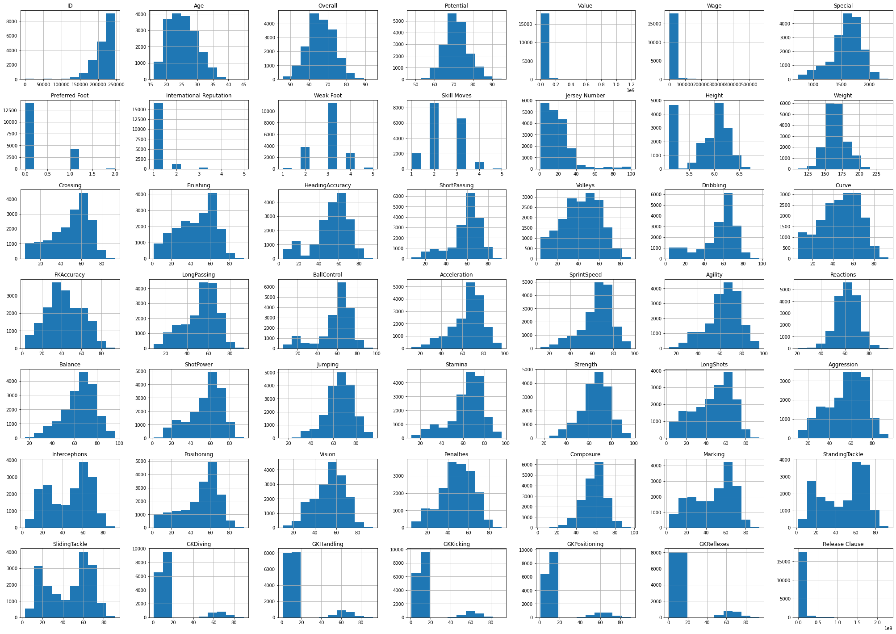
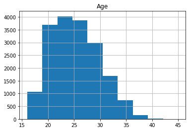
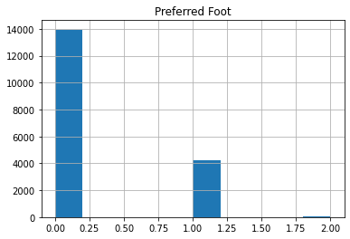
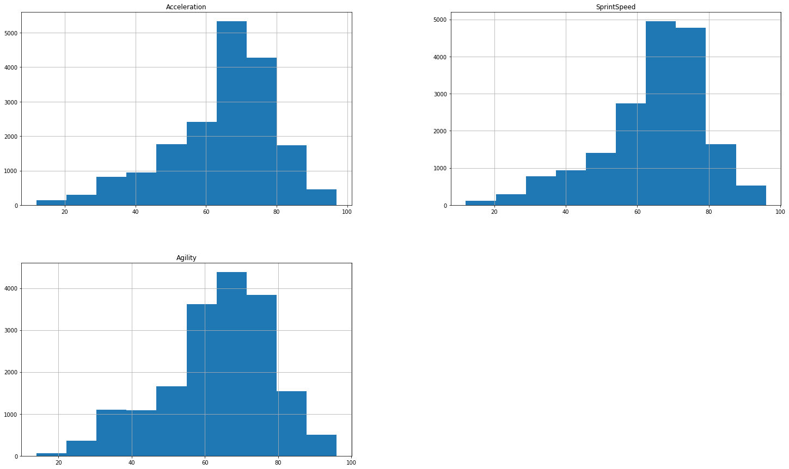
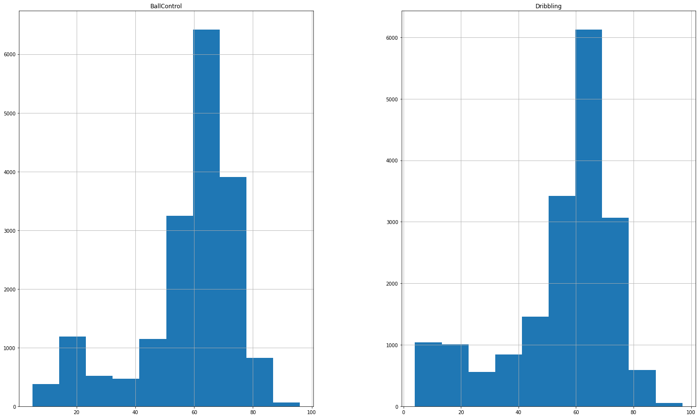
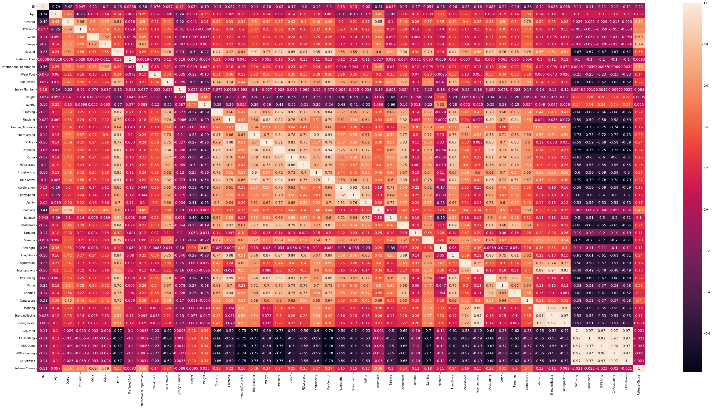
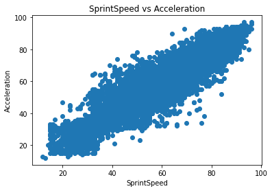
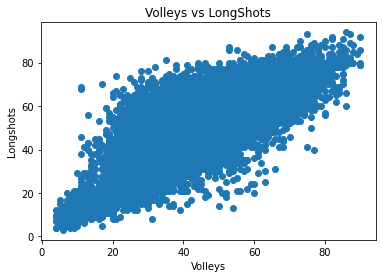

# Assignment 1

## fifa19 players dataset


```python
import pandas as pd
import seaborn as sns
import matplotlib.pyplot as plt
df = pd.read_csv("data.csv", index_col=0)
```


```python
pd.set_option('display.max_columns', None)
```


```python
df
```


<div>
<style>
    .dataframe tbody tr th:only-of-type {
        vertical-align: middle;
    }

    .dataframe tbody tr th {
        vertical-align: top;
    }

    .dataframe thead th {
        text-align: right;
    }
</style>
<table border="1" class="dataframe">
  <thead>
    <tr style="text-align: right;">
      <th></th>
      <th>ID</th>
      <th>Name</th>
      <th>Age</th>
      <th>Photo</th>
      <th>Nationality</th>
      <th>Flag</th>
      <th>Overall</th>
      <th>Potential</th>
      <th>Club</th>
      <th>Club Logo</th>
      <th>Value</th>
      <th>Wage</th>
      <th>Special</th>
      <th>Preferred Foot</th>
      <th>International Reputation</th>
      <th>Weak Foot</th>
      <th>Skill Moves</th>
      <th>Work Rate</th>
      <th>Body Type</th>
      <th>Real Face</th>
      <th>Position</th>
      <th>Jersey Number</th>
      <th>Joined</th>
      <th>Loaned From</th>
      <th>Contract Valid Until</th>
      <th>Height</th>
      <th>Weight</th>
      <th>LS</th>
      <th>ST</th>
      <th>RS</th>
      <th>LW</th>
      <th>LF</th>
      <th>CF</th>
      <th>RF</th>
      <th>RW</th>
      <th>LAM</th>
      <th>CAM</th>
      <th>RAM</th>
      <th>LM</th>
      <th>LCM</th>
      <th>CM</th>
      <th>RCM</th>
      <th>RM</th>
      <th>LWB</th>
      <th>LDM</th>
      <th>CDM</th>
      <th>RDM</th>
      <th>RWB</th>
      <th>LB</th>
      <th>LCB</th>
      <th>CB</th>
      <th>RCB</th>
      <th>RB</th>
      <th>Crossing</th>
      <th>Finishing</th>
      <th>HeadingAccuracy</th>
      <th>ShortPassing</th>
      <th>Volleys</th>
      <th>Dribbling</th>
      <th>Curve</th>
      <th>FKAccuracy</th>
      <th>LongPassing</th>
      <th>BallControl</th>
      <th>Acceleration</th>
      <th>SprintSpeed</th>
      <th>Agility</th>
      <th>Reactions</th>
      <th>Balance</th>
      <th>ShotPower</th>
      <th>Jumping</th>
      <th>Stamina</th>
      <th>Strength</th>
      <th>LongShots</th>
      <th>Aggression</th>
      <th>Interceptions</th>
      <th>Positioning</th>
      <th>Vision</th>
      <th>Penalties</th>
      <th>Composure</th>
      <th>Marking</th>
      <th>StandingTackle</th>
      <th>SlidingTackle</th>
      <th>GKDiving</th>
      <th>GKHandling</th>
      <th>GKKicking</th>
      <th>GKPositioning</th>
      <th>GKReflexes</th>
      <th>Release Clause</th>
    </tr>
  </thead>
  <tbody>
    <tr>
      <th>0</th>
      <td>158023</td>
      <td>L. Messi</td>
      <td>31</td>
      <td>https://cdn.sofifa.org/players/4/19/158023.png</td>
      <td>Argentina</td>
      <td>https://cdn.sofifa.org/flags/52.png</td>
      <td>94</td>
      <td>94</td>
      <td>FC Barcelona</td>
      <td>https://cdn.sofifa.org/teams/2/light/241.png</td>
      <td>€110.5M</td>
      <td>€565K</td>
      <td>2202</td>
      <td>Left</td>
      <td>5.0</td>
      <td>4.0</td>
      <td>4.0</td>
      <td>Medium/ Medium</td>
      <td>Messi</td>
      <td>Yes</td>
      <td>RF</td>
      <td>10.0</td>
      <td>Jul 1, 2004</td>
      <td>NaN</td>
      <td>2021</td>
      <td>5'7</td>
      <td>159lbs</td>
      <td>88+2</td>
      <td>88+2</td>
      <td>88+2</td>
      <td>92+2</td>
      <td>93+2</td>
      <td>93+2</td>
      <td>93+2</td>
      <td>92+2</td>
      <td>93+2</td>
      <td>93+2</td>
      <td>93+2</td>
      <td>91+2</td>
      <td>84+2</td>
      <td>84+2</td>
      <td>84+2</td>
      <td>91+2</td>
      <td>64+2</td>
      <td>61+2</td>
      <td>61+2</td>
      <td>61+2</td>
      <td>64+2</td>
      <td>59+2</td>
      <td>47+2</td>
      <td>47+2</td>
      <td>47+2</td>
      <td>59+2</td>
      <td>84.0</td>
      <td>95.0</td>
      <td>70.0</td>
      <td>90.0</td>
      <td>86.0</td>
      <td>97.0</td>
      <td>93.0</td>
      <td>94.0</td>
      <td>87.0</td>
      <td>96.0</td>
      <td>91.0</td>
      <td>86.0</td>
      <td>91.0</td>
      <td>95.0</td>
      <td>95.0</td>
      <td>85.0</td>
      <td>68.0</td>
      <td>72.0</td>
      <td>59.0</td>
      <td>94.0</td>
      <td>48.0</td>
      <td>22.0</td>
      <td>94.0</td>
      <td>94.0</td>
      <td>75.0</td>
      <td>96.0</td>
      <td>33.0</td>
      <td>28.0</td>
      <td>26.0</td>
      <td>6.0</td>
      <td>11.0</td>
      <td>15.0</td>
      <td>14.0</td>
      <td>8.0</td>
      <td>€226.5M</td>
    </tr>
    <tr>
      <th>1</th>
      <td>20801</td>
      <td>Cristiano Ronaldo</td>
      <td>33</td>
      <td>https://cdn.sofifa.org/players/4/19/20801.png</td>
      <td>Portugal</td>
      <td>https://cdn.sofifa.org/flags/38.png</td>
      <td>94</td>
      <td>94</td>
      <td>Juventus</td>
      <td>https://cdn.sofifa.org/teams/2/light/45.png</td>
      <td>€77M</td>
      <td>€405K</td>
      <td>2228</td>
      <td>Right</td>
      <td>5.0</td>
      <td>4.0</td>
      <td>5.0</td>
      <td>High/ Low</td>
      <td>C. Ronaldo</td>
      <td>Yes</td>
      <td>ST</td>
      <td>7.0</td>
      <td>Jul 10, 2018</td>
      <td>NaN</td>
      <td>2022</td>
      <td>6'2</td>
      <td>183lbs</td>
      <td>91+3</td>
      <td>91+3</td>
      <td>91+3</td>
      <td>89+3</td>
      <td>90+3</td>
      <td>90+3</td>
      <td>90+3</td>
      <td>89+3</td>
      <td>88+3</td>
      <td>88+3</td>
      <td>88+3</td>
      <td>88+3</td>
      <td>81+3</td>
      <td>81+3</td>
      <td>81+3</td>
      <td>88+3</td>
      <td>65+3</td>
      <td>61+3</td>
      <td>61+3</td>
      <td>61+3</td>
      <td>65+3</td>
      <td>61+3</td>
      <td>53+3</td>
      <td>53+3</td>
      <td>53+3</td>
      <td>61+3</td>
      <td>84.0</td>
      <td>94.0</td>
      <td>89.0</td>
      <td>81.0</td>
      <td>87.0</td>
      <td>88.0</td>
      <td>81.0</td>
      <td>76.0</td>
      <td>77.0</td>
      <td>94.0</td>
      <td>89.0</td>
      <td>91.0</td>
      <td>87.0</td>
      <td>96.0</td>
      <td>70.0</td>
      <td>95.0</td>
      <td>95.0</td>
      <td>88.0</td>
      <td>79.0</td>
      <td>93.0</td>
      <td>63.0</td>
      <td>29.0</td>
      <td>95.0</td>
      <td>82.0</td>
      <td>85.0</td>
      <td>95.0</td>
      <td>28.0</td>
      <td>31.0</td>
      <td>23.0</td>
      <td>7.0</td>
      <td>11.0</td>
      <td>15.0</td>
      <td>14.0</td>
      <td>11.0</td>
      <td>€127.1M</td>
    </tr>
    <tr>
      <th>2</th>
      <td>190871</td>
      <td>Neymar Jr</td>
      <td>26</td>
      <td>https://cdn.sofifa.org/players/4/19/190871.png</td>
      <td>Brazil</td>
      <td>https://cdn.sofifa.org/flags/54.png</td>
      <td>92</td>
      <td>93</td>
      <td>Paris Saint-Germain</td>
      <td>https://cdn.sofifa.org/teams/2/light/73.png</td>
      <td>€118.5M</td>
      <td>€290K</td>
      <td>2143</td>
      <td>Right</td>
      <td>5.0</td>
      <td>5.0</td>
      <td>5.0</td>
      <td>High/ Medium</td>
      <td>Neymar</td>
      <td>Yes</td>
      <td>LW</td>
      <td>10.0</td>
      <td>Aug 3, 2017</td>
      <td>NaN</td>
      <td>2022</td>
      <td>5'9</td>
      <td>150lbs</td>
      <td>84+3</td>
      <td>84+3</td>
      <td>84+3</td>
      <td>89+3</td>
      <td>89+3</td>
      <td>89+3</td>
      <td>89+3</td>
      <td>89+3</td>
      <td>89+3</td>
      <td>89+3</td>
      <td>89+3</td>
      <td>88+3</td>
      <td>81+3</td>
      <td>81+3</td>
      <td>81+3</td>
      <td>88+3</td>
      <td>65+3</td>
      <td>60+3</td>
      <td>60+3</td>
      <td>60+3</td>
      <td>65+3</td>
      <td>60+3</td>
      <td>47+3</td>
      <td>47+3</td>
      <td>47+3</td>
      <td>60+3</td>
      <td>79.0</td>
      <td>87.0</td>
      <td>62.0</td>
      <td>84.0</td>
      <td>84.0</td>
      <td>96.0</td>
      <td>88.0</td>
      <td>87.0</td>
      <td>78.0</td>
      <td>95.0</td>
      <td>94.0</td>
      <td>90.0</td>
      <td>96.0</td>
      <td>94.0</td>
      <td>84.0</td>
      <td>80.0</td>
      <td>61.0</td>
      <td>81.0</td>
      <td>49.0</td>
      <td>82.0</td>
      <td>56.0</td>
      <td>36.0</td>
      <td>89.0</td>
      <td>87.0</td>
      <td>81.0</td>
      <td>94.0</td>
      <td>27.0</td>
      <td>24.0</td>
      <td>33.0</td>
      <td>9.0</td>
      <td>9.0</td>
      <td>15.0</td>
      <td>15.0</td>
      <td>11.0</td>
      <td>€228.1M</td>
    </tr>
    <tr>
      <th>3</th>
      <td>193080</td>
      <td>De Gea</td>
      <td>27</td>
      <td>https://cdn.sofifa.org/players/4/19/193080.png</td>
      <td>Spain</td>
      <td>https://cdn.sofifa.org/flags/45.png</td>
      <td>91</td>
      <td>93</td>
      <td>Manchester United</td>
      <td>https://cdn.sofifa.org/teams/2/light/11.png</td>
      <td>€72M</td>
      <td>€260K</td>
      <td>1471</td>
      <td>Right</td>
      <td>4.0</td>
      <td>3.0</td>
      <td>1.0</td>
      <td>Medium/ Medium</td>
      <td>Lean</td>
      <td>Yes</td>
      <td>GK</td>
      <td>1.0</td>
      <td>Jul 1, 2011</td>
      <td>NaN</td>
      <td>2020</td>
      <td>6'4</td>
      <td>168lbs</td>
      <td>NaN</td>
      <td>NaN</td>
      <td>NaN</td>
      <td>NaN</td>
      <td>NaN</td>
      <td>NaN</td>
      <td>NaN</td>
      <td>NaN</td>
      <td>NaN</td>
      <td>NaN</td>
      <td>NaN</td>
      <td>NaN</td>
      <td>NaN</td>
      <td>NaN</td>
      <td>NaN</td>
      <td>NaN</td>
      <td>NaN</td>
      <td>NaN</td>
      <td>NaN</td>
      <td>NaN</td>
      <td>NaN</td>
      <td>NaN</td>
      <td>NaN</td>
      <td>NaN</td>
      <td>NaN</td>
      <td>NaN</td>
      <td>17.0</td>
      <td>13.0</td>
      <td>21.0</td>
      <td>50.0</td>
      <td>13.0</td>
      <td>18.0</td>
      <td>21.0</td>
      <td>19.0</td>
      <td>51.0</td>
      <td>42.0</td>
      <td>57.0</td>
      <td>58.0</td>
      <td>60.0</td>
      <td>90.0</td>
      <td>43.0</td>
      <td>31.0</td>
      <td>67.0</td>
      <td>43.0</td>
      <td>64.0</td>
      <td>12.0</td>
      <td>38.0</td>
      <td>30.0</td>
      <td>12.0</td>
      <td>68.0</td>
      <td>40.0</td>
      <td>68.0</td>
      <td>15.0</td>
      <td>21.0</td>
      <td>13.0</td>
      <td>90.0</td>
      <td>85.0</td>
      <td>87.0</td>
      <td>88.0</td>
      <td>94.0</td>
      <td>€138.6M</td>
    </tr>
    <tr>
      <th>4</th>
      <td>192985</td>
      <td>K. De Bruyne</td>
      <td>27</td>
      <td>https://cdn.sofifa.org/players/4/19/192985.png</td>
      <td>Belgium</td>
      <td>https://cdn.sofifa.org/flags/7.png</td>
      <td>91</td>
      <td>92</td>
      <td>Manchester City</td>
      <td>https://cdn.sofifa.org/teams/2/light/10.png</td>
      <td>€102M</td>
      <td>€355K</td>
      <td>2281</td>
      <td>Right</td>
      <td>4.0</td>
      <td>5.0</td>
      <td>4.0</td>
      <td>High/ High</td>
      <td>Normal</td>
      <td>Yes</td>
      <td>RCM</td>
      <td>7.0</td>
      <td>Aug 30, 2015</td>
      <td>NaN</td>
      <td>2023</td>
      <td>5'11</td>
      <td>154lbs</td>
      <td>82+3</td>
      <td>82+3</td>
      <td>82+3</td>
      <td>87+3</td>
      <td>87+3</td>
      <td>87+3</td>
      <td>87+3</td>
      <td>87+3</td>
      <td>88+3</td>
      <td>88+3</td>
      <td>88+3</td>
      <td>88+3</td>
      <td>87+3</td>
      <td>87+3</td>
      <td>87+3</td>
      <td>88+3</td>
      <td>77+3</td>
      <td>77+3</td>
      <td>77+3</td>
      <td>77+3</td>
      <td>77+3</td>
      <td>73+3</td>
      <td>66+3</td>
      <td>66+3</td>
      <td>66+3</td>
      <td>73+3</td>
      <td>93.0</td>
      <td>82.0</td>
      <td>55.0</td>
      <td>92.0</td>
      <td>82.0</td>
      <td>86.0</td>
      <td>85.0</td>
      <td>83.0</td>
      <td>91.0</td>
      <td>91.0</td>
      <td>78.0</td>
      <td>76.0</td>
      <td>79.0</td>
      <td>91.0</td>
      <td>77.0</td>
      <td>91.0</td>
      <td>63.0</td>
      <td>90.0</td>
      <td>75.0</td>
      <td>91.0</td>
      <td>76.0</td>
      <td>61.0</td>
      <td>87.0</td>
      <td>94.0</td>
      <td>79.0</td>
      <td>88.0</td>
      <td>68.0</td>
      <td>58.0</td>
      <td>51.0</td>
      <td>15.0</td>
      <td>13.0</td>
      <td>5.0</td>
      <td>10.0</td>
      <td>13.0</td>
      <td>€196.4M</td>
    </tr>
    <tr>
      <th>...</th>
      <td>...</td>
      <td>...</td>
      <td>...</td>
      <td>...</td>
      <td>...</td>
      <td>...</td>
      <td>...</td>
      <td>...</td>
      <td>...</td>
      <td>...</td>
      <td>...</td>
      <td>...</td>
      <td>...</td>
      <td>...</td>
      <td>...</td>
      <td>...</td>
      <td>...</td>
      <td>...</td>
      <td>...</td>
      <td>...</td>
      <td>...</td>
      <td>...</td>
      <td>...</td>
      <td>...</td>
      <td>...</td>
      <td>...</td>
      <td>...</td>
      <td>...</td>
      <td>...</td>
      <td>...</td>
      <td>...</td>
      <td>...</td>
      <td>...</td>
      <td>...</td>
      <td>...</td>
      <td>...</td>
      <td>...</td>
      <td>...</td>
      <td>...</td>
      <td>...</td>
      <td>...</td>
      <td>...</td>
      <td>...</td>
      <td>...</td>
      <td>...</td>
      <td>...</td>
      <td>...</td>
      <td>...</td>
      <td>...</td>
      <td>...</td>
      <td>...</td>
      <td>...</td>
      <td>...</td>
      <td>...</td>
      <td>...</td>
      <td>...</td>
      <td>...</td>
      <td>...</td>
      <td>...</td>
      <td>...</td>
      <td>...</td>
      <td>...</td>
      <td>...</td>
      <td>...</td>
      <td>...</td>
      <td>...</td>
      <td>...</td>
      <td>...</td>
      <td>...</td>
      <td>...</td>
      <td>...</td>
      <td>...</td>
      <td>...</td>
      <td>...</td>
      <td>...</td>
      <td>...</td>
      <td>...</td>
      <td>...</td>
      <td>...</td>
      <td>...</td>
      <td>...</td>
      <td>...</td>
      <td>...</td>
      <td>...</td>
      <td>...</td>
      <td>...</td>
      <td>...</td>
      <td>...</td>
    </tr>
    <tr>
      <th>18202</th>
      <td>238813</td>
      <td>J. Lundstram</td>
      <td>19</td>
      <td>https://cdn.sofifa.org/players/4/19/238813.png</td>
      <td>England</td>
      <td>https://cdn.sofifa.org/flags/14.png</td>
      <td>47</td>
      <td>65</td>
      <td>Crewe Alexandra</td>
      <td>https://cdn.sofifa.org/teams/2/light/121.png</td>
      <td>€60K</td>
      <td>€1K</td>
      <td>1307</td>
      <td>Right</td>
      <td>1.0</td>
      <td>2.0</td>
      <td>2.0</td>
      <td>Medium/ Medium</td>
      <td>Lean</td>
      <td>No</td>
      <td>CM</td>
      <td>22.0</td>
      <td>May 3, 2017</td>
      <td>NaN</td>
      <td>2019</td>
      <td>5'9</td>
      <td>134lbs</td>
      <td>42+2</td>
      <td>42+2</td>
      <td>42+2</td>
      <td>44+2</td>
      <td>44+2</td>
      <td>44+2</td>
      <td>44+2</td>
      <td>44+2</td>
      <td>45+2</td>
      <td>45+2</td>
      <td>45+2</td>
      <td>44+2</td>
      <td>45+2</td>
      <td>45+2</td>
      <td>45+2</td>
      <td>44+2</td>
      <td>44+2</td>
      <td>45+2</td>
      <td>45+2</td>
      <td>45+2</td>
      <td>44+2</td>
      <td>45+2</td>
      <td>45+2</td>
      <td>45+2</td>
      <td>45+2</td>
      <td>45+2</td>
      <td>34.0</td>
      <td>38.0</td>
      <td>40.0</td>
      <td>49.0</td>
      <td>25.0</td>
      <td>42.0</td>
      <td>30.0</td>
      <td>34.0</td>
      <td>45.0</td>
      <td>43.0</td>
      <td>54.0</td>
      <td>57.0</td>
      <td>60.0</td>
      <td>49.0</td>
      <td>76.0</td>
      <td>43.0</td>
      <td>55.0</td>
      <td>40.0</td>
      <td>47.0</td>
      <td>38.0</td>
      <td>46.0</td>
      <td>46.0</td>
      <td>39.0</td>
      <td>52.0</td>
      <td>43.0</td>
      <td>45.0</td>
      <td>40.0</td>
      <td>48.0</td>
      <td>47.0</td>
      <td>10.0</td>
      <td>13.0</td>
      <td>7.0</td>
      <td>8.0</td>
      <td>9.0</td>
      <td>€143K</td>
    </tr>
    <tr>
      <th>18203</th>
      <td>243165</td>
      <td>N. Christoffersson</td>
      <td>19</td>
      <td>https://cdn.sofifa.org/players/4/19/243165.png</td>
      <td>Sweden</td>
      <td>https://cdn.sofifa.org/flags/46.png</td>
      <td>47</td>
      <td>63</td>
      <td>Trelleborgs FF</td>
      <td>https://cdn.sofifa.org/teams/2/light/703.png</td>
      <td>€60K</td>
      <td>€1K</td>
      <td>1098</td>
      <td>Right</td>
      <td>1.0</td>
      <td>2.0</td>
      <td>2.0</td>
      <td>Medium/ Medium</td>
      <td>Normal</td>
      <td>No</td>
      <td>ST</td>
      <td>21.0</td>
      <td>Mar 19, 2018</td>
      <td>NaN</td>
      <td>2020</td>
      <td>6'3</td>
      <td>170lbs</td>
      <td>45+2</td>
      <td>45+2</td>
      <td>45+2</td>
      <td>39+2</td>
      <td>42+2</td>
      <td>42+2</td>
      <td>42+2</td>
      <td>39+2</td>
      <td>40+2</td>
      <td>40+2</td>
      <td>40+2</td>
      <td>38+2</td>
      <td>35+2</td>
      <td>35+2</td>
      <td>35+2</td>
      <td>38+2</td>
      <td>30+2</td>
      <td>31+2</td>
      <td>31+2</td>
      <td>31+2</td>
      <td>30+2</td>
      <td>29+2</td>
      <td>32+2</td>
      <td>32+2</td>
      <td>32+2</td>
      <td>29+2</td>
      <td>23.0</td>
      <td>52.0</td>
      <td>52.0</td>
      <td>43.0</td>
      <td>36.0</td>
      <td>39.0</td>
      <td>32.0</td>
      <td>20.0</td>
      <td>25.0</td>
      <td>40.0</td>
      <td>41.0</td>
      <td>39.0</td>
      <td>38.0</td>
      <td>40.0</td>
      <td>52.0</td>
      <td>41.0</td>
      <td>47.0</td>
      <td>43.0</td>
      <td>67.0</td>
      <td>42.0</td>
      <td>47.0</td>
      <td>16.0</td>
      <td>46.0</td>
      <td>33.0</td>
      <td>43.0</td>
      <td>42.0</td>
      <td>22.0</td>
      <td>15.0</td>
      <td>19.0</td>
      <td>10.0</td>
      <td>9.0</td>
      <td>9.0</td>
      <td>5.0</td>
      <td>12.0</td>
      <td>€113K</td>
    </tr>
    <tr>
      <th>18204</th>
      <td>241638</td>
      <td>B. Worman</td>
      <td>16</td>
      <td>https://cdn.sofifa.org/players/4/19/241638.png</td>
      <td>England</td>
      <td>https://cdn.sofifa.org/flags/14.png</td>
      <td>47</td>
      <td>67</td>
      <td>Cambridge United</td>
      <td>https://cdn.sofifa.org/teams/2/light/1944.png</td>
      <td>€60K</td>
      <td>€1K</td>
      <td>1189</td>
      <td>Right</td>
      <td>1.0</td>
      <td>3.0</td>
      <td>2.0</td>
      <td>Medium/ Medium</td>
      <td>Normal</td>
      <td>No</td>
      <td>ST</td>
      <td>33.0</td>
      <td>Jul 1, 2017</td>
      <td>NaN</td>
      <td>2021</td>
      <td>5'8</td>
      <td>148lbs</td>
      <td>45+2</td>
      <td>45+2</td>
      <td>45+2</td>
      <td>45+2</td>
      <td>46+2</td>
      <td>46+2</td>
      <td>46+2</td>
      <td>45+2</td>
      <td>44+2</td>
      <td>44+2</td>
      <td>44+2</td>
      <td>44+2</td>
      <td>38+2</td>
      <td>38+2</td>
      <td>38+2</td>
      <td>44+2</td>
      <td>34+2</td>
      <td>30+2</td>
      <td>30+2</td>
      <td>30+2</td>
      <td>34+2</td>
      <td>33+2</td>
      <td>28+2</td>
      <td>28+2</td>
      <td>28+2</td>
      <td>33+2</td>
      <td>25.0</td>
      <td>40.0</td>
      <td>46.0</td>
      <td>38.0</td>
      <td>38.0</td>
      <td>45.0</td>
      <td>38.0</td>
      <td>27.0</td>
      <td>28.0</td>
      <td>44.0</td>
      <td>70.0</td>
      <td>69.0</td>
      <td>50.0</td>
      <td>47.0</td>
      <td>58.0</td>
      <td>45.0</td>
      <td>60.0</td>
      <td>55.0</td>
      <td>32.0</td>
      <td>45.0</td>
      <td>32.0</td>
      <td>15.0</td>
      <td>48.0</td>
      <td>43.0</td>
      <td>55.0</td>
      <td>41.0</td>
      <td>32.0</td>
      <td>13.0</td>
      <td>11.0</td>
      <td>6.0</td>
      <td>5.0</td>
      <td>10.0</td>
      <td>6.0</td>
      <td>13.0</td>
      <td>€165K</td>
    </tr>
    <tr>
      <th>18205</th>
      <td>246268</td>
      <td>D. Walker-Rice</td>
      <td>17</td>
      <td>https://cdn.sofifa.org/players/4/19/246268.png</td>
      <td>England</td>
      <td>https://cdn.sofifa.org/flags/14.png</td>
      <td>47</td>
      <td>66</td>
      <td>Tranmere Rovers</td>
      <td>https://cdn.sofifa.org/teams/2/light/15048.png</td>
      <td>€60K</td>
      <td>€1K</td>
      <td>1228</td>
      <td>Right</td>
      <td>1.0</td>
      <td>3.0</td>
      <td>2.0</td>
      <td>Medium/ Medium</td>
      <td>Lean</td>
      <td>No</td>
      <td>RW</td>
      <td>34.0</td>
      <td>Apr 24, 2018</td>
      <td>NaN</td>
      <td>2019</td>
      <td>5'10</td>
      <td>154lbs</td>
      <td>47+2</td>
      <td>47+2</td>
      <td>47+2</td>
      <td>47+2</td>
      <td>46+2</td>
      <td>46+2</td>
      <td>46+2</td>
      <td>47+2</td>
      <td>45+2</td>
      <td>45+2</td>
      <td>45+2</td>
      <td>46+2</td>
      <td>39+2</td>
      <td>39+2</td>
      <td>39+2</td>
      <td>46+2</td>
      <td>36+2</td>
      <td>32+2</td>
      <td>32+2</td>
      <td>32+2</td>
      <td>36+2</td>
      <td>35+2</td>
      <td>31+2</td>
      <td>31+2</td>
      <td>31+2</td>
      <td>35+2</td>
      <td>44.0</td>
      <td>50.0</td>
      <td>39.0</td>
      <td>42.0</td>
      <td>40.0</td>
      <td>51.0</td>
      <td>34.0</td>
      <td>32.0</td>
      <td>32.0</td>
      <td>52.0</td>
      <td>61.0</td>
      <td>60.0</td>
      <td>52.0</td>
      <td>21.0</td>
      <td>71.0</td>
      <td>64.0</td>
      <td>42.0</td>
      <td>40.0</td>
      <td>48.0</td>
      <td>34.0</td>
      <td>33.0</td>
      <td>22.0</td>
      <td>44.0</td>
      <td>47.0</td>
      <td>50.0</td>
      <td>46.0</td>
      <td>20.0</td>
      <td>25.0</td>
      <td>27.0</td>
      <td>14.0</td>
      <td>6.0</td>
      <td>14.0</td>
      <td>8.0</td>
      <td>9.0</td>
      <td>€143K</td>
    </tr>
    <tr>
      <th>18206</th>
      <td>246269</td>
      <td>G. Nugent</td>
      <td>16</td>
      <td>https://cdn.sofifa.org/players/4/19/246269.png</td>
      <td>England</td>
      <td>https://cdn.sofifa.org/flags/14.png</td>
      <td>46</td>
      <td>66</td>
      <td>Tranmere Rovers</td>
      <td>https://cdn.sofifa.org/teams/2/light/15048.png</td>
      <td>€60K</td>
      <td>€1K</td>
      <td>1321</td>
      <td>Right</td>
      <td>1.0</td>
      <td>3.0</td>
      <td>2.0</td>
      <td>Medium/ Medium</td>
      <td>Lean</td>
      <td>No</td>
      <td>CM</td>
      <td>33.0</td>
      <td>Oct 30, 2018</td>
      <td>NaN</td>
      <td>2019</td>
      <td>5'10</td>
      <td>176lbs</td>
      <td>43+2</td>
      <td>43+2</td>
      <td>43+2</td>
      <td>45+2</td>
      <td>44+2</td>
      <td>44+2</td>
      <td>44+2</td>
      <td>45+2</td>
      <td>45+2</td>
      <td>45+2</td>
      <td>45+2</td>
      <td>46+2</td>
      <td>45+2</td>
      <td>45+2</td>
      <td>45+2</td>
      <td>46+2</td>
      <td>46+2</td>
      <td>46+2</td>
      <td>46+2</td>
      <td>46+2</td>
      <td>46+2</td>
      <td>46+2</td>
      <td>47+2</td>
      <td>47+2</td>
      <td>47+2</td>
      <td>46+2</td>
      <td>41.0</td>
      <td>34.0</td>
      <td>46.0</td>
      <td>48.0</td>
      <td>30.0</td>
      <td>43.0</td>
      <td>40.0</td>
      <td>34.0</td>
      <td>44.0</td>
      <td>51.0</td>
      <td>57.0</td>
      <td>55.0</td>
      <td>55.0</td>
      <td>51.0</td>
      <td>63.0</td>
      <td>43.0</td>
      <td>62.0</td>
      <td>47.0</td>
      <td>60.0</td>
      <td>32.0</td>
      <td>56.0</td>
      <td>42.0</td>
      <td>34.0</td>
      <td>49.0</td>
      <td>33.0</td>
      <td>43.0</td>
      <td>40.0</td>
      <td>43.0</td>
      <td>50.0</td>
      <td>10.0</td>
      <td>15.0</td>
      <td>9.0</td>
      <td>12.0</td>
      <td>9.0</td>
      <td>€165K</td>
    </tr>
  </tbody>
</table>
<p>18207 rows × 88 columns</p>
</div>


# Cleanup
The dataset has some information that either cannot be analyzed or needs to be changed<br><br>
### Removed
+ Photo
+ Flag
+ Club Logo

### Changed
+ Value
+ Wage
+ Release Clause
+ Preferred Foot
+ Height
+ Weight


## Changes
### Value, Wage, Release Clause
Each value of column **Value**, **Wage**, **Release Clause**, `x = df.loc[:,['Value|Wage|Release Clause']]` has format: *€x[M,K]*.<br>
The character **€** is removed and depending on **M** or **K** the value is changed.<br>
Ex: €110.5M -> 110500000 | €260K -> 260000<br>


```python
## Applying the changes for Value, Wage and Release Clause

arr = ['Value','Wage', 'Release Clause']
for x in arr:
    df[x] = df[x].str.strip('€')
    df[x] = df[x].str.translate(str.maketrans({'.':'','K':'000','M':'000000'}))
    df[x] = df[x].fillna("0")
    df[x] = pd.to_numeric(df[x])


```

### Preferred Foot
The values Right and left, and null are changed to 0, 1, and 2<br>
Right -> 0 <br>
Left -> 1 <br>
null -> 2


```python
## Right -> 0, Left -> 1
df['Preferred Foot'] = df['Preferred Foot'].str.replace("Right","0")
df['Preferred Foot'] = df['Preferred Foot'].str.replace("Left","1")
## Changing null values to 2
df['Preferred Foot'] = df['Preferred Foot'].fillna("2")
df['Preferred Foot'] = pd.to_numeric(df['Preferred Foot'])
```

### Height
The height is transformed to a readable numerical value
5'11 -> 5.11<br>
Null value changed with the average value ~5.8


```python

```


```python
df['Height'] = df['Height'].str.translate(str.maketrans({"'":"."}))
df['Height'] = pd.to_numeric(df['Height'])
df['Height'] = df['Height'].fillna(df.Height.mean())
```


```python
df['Height'].describe()
```


    count    18207.000000
    mean         5.797367
    std          0.447641
    min          5.100000
    25%          5.110000
    50%          5.900000
    75%          6.100000
    max          6.900000
    Name: Height, dtype: float64


## Weight
The characters **lbs** are removed
158lbs -> 158


```python
df['Weight'] = ((df['Weight'].str.strip('lbs')))
df['Weight'] = pd.to_numeric(df['Weight'])
df['Weight']
```


    0        159.0
    1        183.0
    2        150.0
    3        168.0
    4        154.0
             ...  
    18202    134.0
    18203    170.0
    18204    148.0
    18205    154.0
    18206    176.0
    Name: Weight, Length: 18207, dtype: float64


## Photo, Flag, Club Logo


```python
df = df.drop(columns=['Photo', 'Flag', 'Club Logo'])
```

# Average age of the players
The method `describe()` can be used in this case. More specifically, invoking `mean()` on the the dataframe column **Age** returns the average age of the players: **25.122206**


```python
df.describe()
```


<div>
<style>
    .dataframe tbody tr th:only-of-type {
        vertical-align: middle;
    }

    .dataframe tbody tr th {
        vertical-align: top;
    }

    .dataframe thead th {
        text-align: right;
    }
</style>
<table border="1" class="dataframe">
  <thead>
    <tr style="text-align: right;">
      <th></th>
      <th>ID</th>
      <th>Age</th>
      <th>Overall</th>
      <th>Potential</th>
      <th>Value</th>
      <th>Wage</th>
      <th>Special</th>
      <th>Preferred Foot</th>
      <th>International Reputation</th>
      <th>Weak Foot</th>
      <th>Skill Moves</th>
      <th>Jersey Number</th>
      <th>Height</th>
      <th>Weight</th>
      <th>Crossing</th>
      <th>Finishing</th>
      <th>HeadingAccuracy</th>
      <th>ShortPassing</th>
      <th>Volleys</th>
      <th>Dribbling</th>
      <th>Curve</th>
      <th>FKAccuracy</th>
      <th>LongPassing</th>
      <th>BallControl</th>
      <th>Acceleration</th>
      <th>SprintSpeed</th>
      <th>Agility</th>
      <th>Reactions</th>
      <th>Balance</th>
      <th>ShotPower</th>
      <th>Jumping</th>
      <th>Stamina</th>
      <th>Strength</th>
      <th>LongShots</th>
      <th>Aggression</th>
      <th>Interceptions</th>
      <th>Positioning</th>
      <th>Vision</th>
      <th>Penalties</th>
      <th>Composure</th>
      <th>Marking</th>
      <th>StandingTackle</th>
      <th>SlidingTackle</th>
      <th>GKDiving</th>
      <th>GKHandling</th>
      <th>GKKicking</th>
      <th>GKPositioning</th>
      <th>GKReflexes</th>
      <th>Release Clause</th>
    </tr>
  </thead>
  <tbody>
    <tr>
      <th>count</th>
      <td>18207.000000</td>
      <td>18207.000000</td>
      <td>18207.000000</td>
      <td>18207.000000</td>
      <td>1.820700e+04</td>
      <td>18207.000000</td>
      <td>18207.000000</td>
      <td>18207.000000</td>
      <td>18159.000000</td>
      <td>18159.000000</td>
      <td>18159.000000</td>
      <td>18147.000000</td>
      <td>18207.000000</td>
      <td>18159.000000</td>
      <td>18159.000000</td>
      <td>18159.000000</td>
      <td>18159.000000</td>
      <td>18159.000000</td>
      <td>18159.000000</td>
      <td>18159.000000</td>
      <td>18159.000000</td>
      <td>18159.000000</td>
      <td>18159.000000</td>
      <td>18159.000000</td>
      <td>18159.000000</td>
      <td>18159.000000</td>
      <td>18159.000000</td>
      <td>18159.000000</td>
      <td>18159.000000</td>
      <td>18159.000000</td>
      <td>18159.000000</td>
      <td>18159.000000</td>
      <td>18159.000000</td>
      <td>18159.000000</td>
      <td>18159.000000</td>
      <td>18159.000000</td>
      <td>18159.000000</td>
      <td>18159.000000</td>
      <td>18159.000000</td>
      <td>18159.000000</td>
      <td>18159.000000</td>
      <td>18159.000000</td>
      <td>18159.000000</td>
      <td>18159.000000</td>
      <td>18159.000000</td>
      <td>18159.000000</td>
      <td>18159.000000</td>
      <td>18159.000000</td>
      <td>1.820700e+04</td>
    </tr>
    <tr>
      <th>mean</th>
      <td>214298.338606</td>
      <td>25.122206</td>
      <td>66.238699</td>
      <td>71.307299</td>
      <td>1.362983e+07</td>
      <td>9731.312133</td>
      <td>1597.809908</td>
      <td>0.236557</td>
      <td>1.113222</td>
      <td>2.947299</td>
      <td>2.361308</td>
      <td>19.546096</td>
      <td>5.797367</td>
      <td>165.979129</td>
      <td>49.734181</td>
      <td>45.550911</td>
      <td>52.298144</td>
      <td>58.686712</td>
      <td>42.909026</td>
      <td>55.371001</td>
      <td>47.170824</td>
      <td>42.863153</td>
      <td>52.711933</td>
      <td>58.369459</td>
      <td>64.614076</td>
      <td>64.726967</td>
      <td>63.503607</td>
      <td>61.836610</td>
      <td>63.966573</td>
      <td>55.460047</td>
      <td>65.089432</td>
      <td>63.219946</td>
      <td>65.311967</td>
      <td>47.109973</td>
      <td>55.868991</td>
      <td>46.698276</td>
      <td>49.958478</td>
      <td>53.400903</td>
      <td>48.548598</td>
      <td>58.648274</td>
      <td>47.281623</td>
      <td>47.697836</td>
      <td>45.661435</td>
      <td>16.616223</td>
      <td>16.391596</td>
      <td>16.232061</td>
      <td>16.388898</td>
      <td>16.710887</td>
      <td>3.620049e+07</td>
    </tr>
    <tr>
      <th>std</th>
      <td>29965.244204</td>
      <td>4.669943</td>
      <td>6.908930</td>
      <td>6.136496</td>
      <td>3.987587e+07</td>
      <td>21999.290406</td>
      <td>272.586016</td>
      <td>0.431139</td>
      <td>0.394031</td>
      <td>0.660456</td>
      <td>0.756164</td>
      <td>15.947765</td>
      <td>0.447641</td>
      <td>15.593344</td>
      <td>18.364524</td>
      <td>19.525820</td>
      <td>17.379909</td>
      <td>14.699495</td>
      <td>17.694408</td>
      <td>18.910371</td>
      <td>18.395264</td>
      <td>17.478763</td>
      <td>15.327870</td>
      <td>16.686595</td>
      <td>14.927780</td>
      <td>14.649953</td>
      <td>14.766049</td>
      <td>9.010464</td>
      <td>14.136166</td>
      <td>17.237958</td>
      <td>11.820044</td>
      <td>15.894741</td>
      <td>12.557000</td>
      <td>19.260524</td>
      <td>17.367967</td>
      <td>20.696909</td>
      <td>19.529036</td>
      <td>14.146881</td>
      <td>15.704053</td>
      <td>11.436133</td>
      <td>19.904397</td>
      <td>21.664004</td>
      <td>21.289135</td>
      <td>17.695349</td>
      <td>16.906900</td>
      <td>16.502864</td>
      <td>17.034669</td>
      <td>17.955119</td>
      <td>1.033686e+08</td>
    </tr>
    <tr>
      <th>min</th>
      <td>16.000000</td>
      <td>16.000000</td>
      <td>46.000000</td>
      <td>48.000000</td>
      <td>0.000000e+00</td>
      <td>0.000000</td>
      <td>731.000000</td>
      <td>0.000000</td>
      <td>1.000000</td>
      <td>1.000000</td>
      <td>1.000000</td>
      <td>1.000000</td>
      <td>5.100000</td>
      <td>110.000000</td>
      <td>5.000000</td>
      <td>2.000000</td>
      <td>4.000000</td>
      <td>7.000000</td>
      <td>4.000000</td>
      <td>4.000000</td>
      <td>6.000000</td>
      <td>3.000000</td>
      <td>9.000000</td>
      <td>5.000000</td>
      <td>12.000000</td>
      <td>12.000000</td>
      <td>14.000000</td>
      <td>21.000000</td>
      <td>16.000000</td>
      <td>2.000000</td>
      <td>15.000000</td>
      <td>12.000000</td>
      <td>17.000000</td>
      <td>3.000000</td>
      <td>11.000000</td>
      <td>3.000000</td>
      <td>2.000000</td>
      <td>10.000000</td>
      <td>5.000000</td>
      <td>3.000000</td>
      <td>3.000000</td>
      <td>2.000000</td>
      <td>3.000000</td>
      <td>1.000000</td>
      <td>1.000000</td>
      <td>1.000000</td>
      <td>1.000000</td>
      <td>1.000000</td>
      <td>0.000000e+00</td>
    </tr>
    <tr>
      <th>25%</th>
      <td>200315.500000</td>
      <td>21.000000</td>
      <td>62.000000</td>
      <td>67.000000</td>
      <td>3.000000e+05</td>
      <td>1000.000000</td>
      <td>1457.000000</td>
      <td>0.000000</td>
      <td>1.000000</td>
      <td>3.000000</td>
      <td>2.000000</td>
      <td>8.000000</td>
      <td>5.110000</td>
      <td>154.000000</td>
      <td>38.000000</td>
      <td>30.000000</td>
      <td>44.000000</td>
      <td>54.000000</td>
      <td>30.000000</td>
      <td>49.000000</td>
      <td>34.000000</td>
      <td>31.000000</td>
      <td>43.000000</td>
      <td>54.000000</td>
      <td>57.000000</td>
      <td>57.000000</td>
      <td>55.000000</td>
      <td>56.000000</td>
      <td>56.000000</td>
      <td>45.000000</td>
      <td>58.000000</td>
      <td>56.000000</td>
      <td>58.000000</td>
      <td>33.000000</td>
      <td>44.000000</td>
      <td>26.000000</td>
      <td>38.000000</td>
      <td>44.000000</td>
      <td>39.000000</td>
      <td>51.000000</td>
      <td>30.000000</td>
      <td>27.000000</td>
      <td>24.000000</td>
      <td>8.000000</td>
      <td>8.000000</td>
      <td>8.000000</td>
      <td>8.000000</td>
      <td>8.000000</td>
      <td>3.920000e+05</td>
    </tr>
    <tr>
      <th>50%</th>
      <td>221759.000000</td>
      <td>25.000000</td>
      <td>66.000000</td>
      <td>71.000000</td>
      <td>6.750000e+05</td>
      <td>3000.000000</td>
      <td>1635.000000</td>
      <td>0.000000</td>
      <td>1.000000</td>
      <td>3.000000</td>
      <td>2.000000</td>
      <td>17.000000</td>
      <td>5.900000</td>
      <td>165.000000</td>
      <td>54.000000</td>
      <td>49.000000</td>
      <td>56.000000</td>
      <td>62.000000</td>
      <td>44.000000</td>
      <td>61.000000</td>
      <td>48.000000</td>
      <td>41.000000</td>
      <td>56.000000</td>
      <td>63.000000</td>
      <td>67.000000</td>
      <td>67.000000</td>
      <td>66.000000</td>
      <td>62.000000</td>
      <td>66.000000</td>
      <td>59.000000</td>
      <td>66.000000</td>
      <td>66.000000</td>
      <td>67.000000</td>
      <td>51.000000</td>
      <td>59.000000</td>
      <td>52.000000</td>
      <td>55.000000</td>
      <td>55.000000</td>
      <td>49.000000</td>
      <td>60.000000</td>
      <td>53.000000</td>
      <td>55.000000</td>
      <td>52.000000</td>
      <td>11.000000</td>
      <td>11.000000</td>
      <td>11.000000</td>
      <td>11.000000</td>
      <td>11.000000</td>
      <td>1.000000e+06</td>
    </tr>
    <tr>
      <th>75%</th>
      <td>236529.500000</td>
      <td>28.000000</td>
      <td>71.000000</td>
      <td>75.000000</td>
      <td>1.300000e+07</td>
      <td>9000.000000</td>
      <td>1787.000000</td>
      <td>0.000000</td>
      <td>1.000000</td>
      <td>3.000000</td>
      <td>3.000000</td>
      <td>26.000000</td>
      <td>6.100000</td>
      <td>176.000000</td>
      <td>64.000000</td>
      <td>62.000000</td>
      <td>64.000000</td>
      <td>68.000000</td>
      <td>57.000000</td>
      <td>68.000000</td>
      <td>62.000000</td>
      <td>57.000000</td>
      <td>64.000000</td>
      <td>69.000000</td>
      <td>75.000000</td>
      <td>75.000000</td>
      <td>74.000000</td>
      <td>68.000000</td>
      <td>74.000000</td>
      <td>68.000000</td>
      <td>73.000000</td>
      <td>74.000000</td>
      <td>74.000000</td>
      <td>62.000000</td>
      <td>69.000000</td>
      <td>64.000000</td>
      <td>64.000000</td>
      <td>64.000000</td>
      <td>60.000000</td>
      <td>67.000000</td>
      <td>64.000000</td>
      <td>66.000000</td>
      <td>64.000000</td>
      <td>14.000000</td>
      <td>14.000000</td>
      <td>14.000000</td>
      <td>14.000000</td>
      <td>14.000000</td>
      <td>2.400000e+07</td>
    </tr>
    <tr>
      <th>max</th>
      <td>246620.000000</td>
      <td>45.000000</td>
      <td>94.000000</td>
      <td>95.000000</td>
      <td>1.185000e+09</td>
      <td>565000.000000</td>
      <td>2346.000000</td>
      <td>2.000000</td>
      <td>5.000000</td>
      <td>5.000000</td>
      <td>5.000000</td>
      <td>99.000000</td>
      <td>6.900000</td>
      <td>243.000000</td>
      <td>93.000000</td>
      <td>95.000000</td>
      <td>94.000000</td>
      <td>93.000000</td>
      <td>90.000000</td>
      <td>97.000000</td>
      <td>94.000000</td>
      <td>94.000000</td>
      <td>93.000000</td>
      <td>96.000000</td>
      <td>97.000000</td>
      <td>96.000000</td>
      <td>96.000000</td>
      <td>96.000000</td>
      <td>96.000000</td>
      <td>95.000000</td>
      <td>95.000000</td>
      <td>96.000000</td>
      <td>97.000000</td>
      <td>94.000000</td>
      <td>95.000000</td>
      <td>92.000000</td>
      <td>95.000000</td>
      <td>94.000000</td>
      <td>92.000000</td>
      <td>96.000000</td>
      <td>94.000000</td>
      <td>93.000000</td>
      <td>91.000000</td>
      <td>90.000000</td>
      <td>92.000000</td>
      <td>91.000000</td>
      <td>90.000000</td>
      <td>94.000000</td>
      <td>2.281000e+09</td>
    </tr>
  </tbody>
</table>
</div>


```python
df.Age.mean()
```


    25.122205745043114


## Name of the oldest player
The **name** of the oldest player can be found with the method `loc()` by leveraging the output from of `max()` with a conditional statement. The Name is return with by specifying the **Name** column: **O. Pérez**


```python
## Finding the name of the oldest player with conditional statement
## The max value for df.Age.max() is 45
(df.loc[df['Age'] == df.Age.max()])['Name']
```


    4741    O. Pérez
    Name: Name, dtype: object


##  The highest salary
The **Wage** column holds the data needed for finding the player's salary. Analyzing the data type of the different columns with the method `info()`, shows that **Wage** is interpreted as an *object*. <br>
The method `head()` shows that the characters **€** and **K** prevent the column data from being interpreted as a numerical value.<br>
The method `strip()` is used to remove the characters **€** and **K**, and the method `astype()` is used to cast the output to *integer*.<br>
The methods `describe()` and `max()` are ultimately used to find the highest salary: **€565K**


```python
df.info()
```

    <class 'pandas.core.frame.DataFrame'>
    Int64Index: 18207 entries, 0 to 18206
    Data columns (total 85 columns):
     #   Column                    Non-Null Count  Dtype  
    ---  ------                    --------------  -----  
     0   ID                        18207 non-null  int64  
     1   Name                      18207 non-null  object 
     2   Age                       18207 non-null  int64  
     3   Nationality               18207 non-null  object 
     4   Overall                   18207 non-null  int64  
     5   Potential                 18207 non-null  int64  
     6   Club                      17966 non-null  object 
     7   Value                     18207 non-null  int64  
     8   Wage                      18207 non-null  int64  
     9   Special                   18207 non-null  int64  
     10  Preferred Foot            18207 non-null  int64  
     11  International Reputation  18159 non-null  float64
     12  Weak Foot                 18159 non-null  float64
     13  Skill Moves               18159 non-null  float64
     14  Work Rate                 18159 non-null  object 
     15  Body Type                 18159 non-null  object 
     16  Real Face                 18159 non-null  object 
     17  Position                  18147 non-null  object 
     18  Jersey Number             18147 non-null  float64
     19  Joined                    16654 non-null  object 
     20  Loaned From               1264 non-null   object 
     21  Contract Valid Until      17918 non-null  object 
     22  Height                    18207 non-null  float64
     23  Weight                    18159 non-null  float64
     24  LS                        16122 non-null  object 
     25  ST                        16122 non-null  object 
     26  RS                        16122 non-null  object 
     27  LW                        16122 non-null  object 
     28  LF                        16122 non-null  object 
     29  CF                        16122 non-null  object 
     30  RF                        16122 non-null  object 
     31  RW                        16122 non-null  object 
     32  LAM                       16122 non-null  object 
     33  CAM                       16122 non-null  object 
     34  RAM                       16122 non-null  object 
     35  LM                        16122 non-null  object 
     36  LCM                       16122 non-null  object 
     37  CM                        16122 non-null  object 
     38  RCM                       16122 non-null  object 
     39  RM                        16122 non-null  object 
     40  LWB                       16122 non-null  object 
     41  LDM                       16122 non-null  object 
     42  CDM                       16122 non-null  object 
     43  RDM                       16122 non-null  object 
     44  RWB                       16122 non-null  object 
     45  LB                        16122 non-null  object 
     46  LCB                       16122 non-null  object 
     47  CB                        16122 non-null  object 
     48  RCB                       16122 non-null  object 
     49  RB                        16122 non-null  object 
     50  Crossing                  18159 non-null  float64
     51  Finishing                 18159 non-null  float64
     52  HeadingAccuracy           18159 non-null  float64
     53  ShortPassing              18159 non-null  float64
     54  Volleys                   18159 non-null  float64
     55  Dribbling                 18159 non-null  float64
     56  Curve                     18159 non-null  float64
     57  FKAccuracy                18159 non-null  float64
     58  LongPassing               18159 non-null  float64
     59  BallControl               18159 non-null  float64
     60  Acceleration              18159 non-null  float64
     61  SprintSpeed               18159 non-null  float64
     62  Agility                   18159 non-null  float64
     63  Reactions                 18159 non-null  float64
     64  Balance                   18159 non-null  float64
     65  ShotPower                 18159 non-null  float64
     66  Jumping                   18159 non-null  float64
     67  Stamina                   18159 non-null  float64
     68  Strength                  18159 non-null  float64
     69  LongShots                 18159 non-null  float64
     70  Aggression                18159 non-null  float64
     71  Interceptions             18159 non-null  float64
     72  Positioning               18159 non-null  float64
     73  Vision                    18159 non-null  float64
     74  Penalties                 18159 non-null  float64
     75  Composure                 18159 non-null  float64
     76  Marking                   18159 non-null  float64
     77  StandingTackle            18159 non-null  float64
     78  SlidingTackle             18159 non-null  float64
     79  GKDiving                  18159 non-null  float64
     80  GKHandling                18159 non-null  float64
     81  GKKicking                 18159 non-null  float64
     82  GKPositioning             18159 non-null  float64
     83  GKReflexes                18159 non-null  float64
     84  Release Clause            18207 non-null  int64  
    dtypes: float64(40), int64(9), object(36)
    memory usage: 11.9+ MB


```python
## Removing the characters with strip() and casting the output to int with astype()
## The highest salary is found with describe()
df['Wage'].describe()
```


    count     18207.000000
    mean       9731.312133
    std       21999.290406
    min           0.000000
    25%        1000.000000
    50%        3000.000000
    75%        9000.000000
    max      565000.000000
    Name: Wage, dtype: float64


```python
## The max value can also be found with max()
df['Wage'].max()
```


    565000


# Histogram
Few things can be noticed from the histograms.


```python
df.hist(figsize=(35,25));
```


    

    


## Age
The Age histogram is skewed to the left, indicating most of the players are between 20 and 30 years old


```python
df.hist(column=["Age"]);
```


    

    


## Preferred Foot
Most of the players prefer the Right foot


```python
df.hist(column=["Preferred Foot"]);
```


    

    


## Acceleration, SprintSpeed, Agility
These three histograms present a similar distribution. Normally these three skills are related.


```python
df.hist(column=["Acceleration", "SprintSpeed", "Agility"], figsize=(25,15));
```


    

    


## Ball Control and Dribbling
The distribution and the outliers are very similar. The similar outliers highlights how ball control and dribbling skills are related. 


```python
df.hist(column=["BallControl", "Dribbling"], figsize=(25,15));
```


    

    


# Correlation


```python
df_corr = df.corr()
df_corr
```


<div>
<style>
    .dataframe tbody tr th:only-of-type {
        vertical-align: middle;
    }

    .dataframe tbody tr th {
        vertical-align: top;
    }

    .dataframe thead th {
        text-align: right;
    }
</style>
<table border="1" class="dataframe">
  <thead>
    <tr style="text-align: right;">
      <th></th>
      <th>ID</th>
      <th>Age</th>
      <th>Overall</th>
      <th>Potential</th>
      <th>Value</th>
      <th>Wage</th>
      <th>Special</th>
      <th>Preferred Foot</th>
      <th>International Reputation</th>
      <th>Weak Foot</th>
      <th>Skill Moves</th>
      <th>Jersey Number</th>
      <th>Height</th>
      <th>Weight</th>
      <th>Crossing</th>
      <th>Finishing</th>
      <th>HeadingAccuracy</th>
      <th>ShortPassing</th>
      <th>Volleys</th>
      <th>Dribbling</th>
      <th>Curve</th>
      <th>FKAccuracy</th>
      <th>LongPassing</th>
      <th>BallControl</th>
      <th>Acceleration</th>
      <th>SprintSpeed</th>
      <th>Agility</th>
      <th>Reactions</th>
      <th>Balance</th>
      <th>ShotPower</th>
      <th>Jumping</th>
      <th>Stamina</th>
      <th>Strength</th>
      <th>LongShots</th>
      <th>Aggression</th>
      <th>Interceptions</th>
      <th>Positioning</th>
      <th>Vision</th>
      <th>Penalties</th>
      <th>Composure</th>
      <th>Marking</th>
      <th>StandingTackle</th>
      <th>SlidingTackle</th>
      <th>GKDiving</th>
      <th>GKHandling</th>
      <th>GKKicking</th>
      <th>GKPositioning</th>
      <th>GKReflexes</th>
      <th>Release Clause</th>
    </tr>
  </thead>
  <tbody>
    <tr>
      <th>ID</th>
      <td>1.000000</td>
      <td>-0.739208</td>
      <td>-0.417025</td>
      <td>0.047074</td>
      <td>-0.106880</td>
      <td>-0.204610</td>
      <td>-0.231352</td>
      <td>0.003771</td>
      <td>-0.356191</td>
      <td>-0.075784</td>
      <td>-0.056914</td>
      <td>0.182074</td>
      <td>-0.054103</td>
      <td>-0.191425</td>
      <td>-0.131994</td>
      <td>-0.082323</td>
      <td>-0.106815</td>
      <td>-0.136279</td>
      <td>-0.159915</td>
      <td>-0.030340</td>
      <td>-0.169511</td>
      <td>-0.199549</td>
      <td>-0.186764</td>
      <td>-0.100184</td>
      <td>0.133236</td>
      <td>0.132437</td>
      <td>-0.019897</td>
      <td>-0.408617</td>
      <td>0.048463</td>
      <td>-0.166133</td>
      <td>-0.169369</td>
      <td>-0.053895</td>
      <td>-0.259756</td>
      <td>-0.161549</td>
      <td>-0.228329</td>
      <td>-0.160602</td>
      <td>-0.088330</td>
      <td>-0.215170</td>
      <td>-0.140657</td>
      <td>-0.384473</td>
      <td>-0.110198</td>
      <td>-0.085929</td>
      <td>-0.068409</td>
      <td>-0.105594</td>
      <td>-0.111149</td>
      <td>-0.106652</td>
      <td>-0.118250</td>
      <td>-0.105778</td>
      <td>-0.114893</td>
    </tr>
    <tr>
      <th>Age</th>
      <td>-0.739208</td>
      <td>1.000000</td>
      <td>0.452350</td>
      <td>-0.253312</td>
      <td>0.058848</td>
      <td>0.141145</td>
      <td>0.236695</td>
      <td>-0.002846</td>
      <td>0.253765</td>
      <td>0.059867</td>
      <td>0.027649</td>
      <td>-0.241156</td>
      <td>0.053174</td>
      <td>0.230213</td>
      <td>0.130545</td>
      <td>0.068660</td>
      <td>0.147183</td>
      <td>0.132894</td>
      <td>0.142472</td>
      <td>0.010166</td>
      <td>0.143276</td>
      <td>0.193467</td>
      <td>0.181310</td>
      <td>0.084969</td>
      <td>-0.158667</td>
      <td>-0.151682</td>
      <td>-0.019395</td>
      <td>0.453124</td>
      <td>-0.089877</td>
      <td>0.156947</td>
      <td>0.177167</td>
      <td>0.097793</td>
      <td>0.332798</td>
      <td>0.155096</td>
      <td>0.265190</td>
      <td>0.197845</td>
      <td>0.082443</td>
      <td>0.187422</td>
      <td>0.139535</td>
      <td>0.391023</td>
      <td>0.142817</td>
      <td>0.119745</td>
      <td>0.103089</td>
      <td>0.101277</td>
      <td>0.106419</td>
      <td>0.104964</td>
      <td>0.116402</td>
      <td>0.103313</td>
      <td>0.057294</td>
    </tr>
    <tr>
      <th>Overall</th>
      <td>-0.417025</td>
      <td>0.452350</td>
      <td>1.000000</td>
      <td>0.660939</td>
      <td>0.499790</td>
      <td>0.571926</td>
      <td>0.606960</td>
      <td>0.036196</td>
      <td>0.499491</td>
      <td>0.212015</td>
      <td>0.414463</td>
      <td>-0.218931</td>
      <td>0.040774</td>
      <td>0.154634</td>
      <td>0.394972</td>
      <td>0.332515</td>
      <td>0.340776</td>
      <td>0.502550</td>
      <td>0.391338</td>
      <td>0.372426</td>
      <td>0.419491</td>
      <td>0.396892</td>
      <td>0.483909</td>
      <td>0.460197</td>
      <td>0.196869</td>
      <td>0.210647</td>
      <td>0.264952</td>
      <td>0.850045</td>
      <td>0.103160</td>
      <td>0.441118</td>
      <td>0.264435</td>
      <td>0.365656</td>
      <td>0.349326</td>
      <td>0.420795</td>
      <td>0.395470</td>
      <td>0.321326</td>
      <td>0.356493</td>
      <td>0.498894</td>
      <td>0.341429</td>
      <td>0.727655</td>
      <td>0.286505</td>
      <td>0.252629</td>
      <td>0.222811</td>
      <td>-0.025937</td>
      <td>-0.025062</td>
      <td>-0.029372</td>
      <td>-0.017674</td>
      <td>-0.023276</td>
      <td>0.562588</td>
    </tr>
    <tr>
      <th>Potential</th>
      <td>0.047074</td>
      <td>-0.253312</td>
      <td>0.660939</td>
      <td>1.000000</td>
      <td>0.457905</td>
      <td>0.486413</td>
      <td>0.383727</td>
      <td>0.028867</td>
      <td>0.372993</td>
      <td>0.162346</td>
      <td>0.354290</td>
      <td>-0.010474</td>
      <td>0.013914</td>
      <td>-0.006947</td>
      <td>0.246319</td>
      <td>0.243355</td>
      <td>0.200988</td>
      <td>0.369189</td>
      <td>0.254906</td>
      <td>0.315019</td>
      <td>0.279944</td>
      <td>0.230544</td>
      <td>0.321437</td>
      <td>0.354396</td>
      <td>0.234608</td>
      <td>0.236771</td>
      <td>0.222310</td>
      <td>0.513425</td>
      <td>0.138025</td>
      <td>0.288318</td>
      <td>0.109151</td>
      <td>0.202563</td>
      <td>0.075769</td>
      <td>0.266740</td>
      <td>0.171174</td>
      <td>0.154908</td>
      <td>0.245616</td>
      <td>0.348141</td>
      <td>0.224281</td>
      <td>0.440008</td>
      <td>0.162801</td>
      <td>0.143564</td>
      <td>0.128980</td>
      <td>-0.053446</td>
      <td>-0.054672</td>
      <td>-0.059061</td>
      <td>-0.052589</td>
      <td>-0.053341</td>
      <td>0.525832</td>
    </tr>
    <tr>
      <th>Value</th>
      <td>-0.106880</td>
      <td>0.058848</td>
      <td>0.499790</td>
      <td>0.457905</td>
      <td>1.000000</td>
      <td>0.623611</td>
      <td>0.310190</td>
      <td>0.009475</td>
      <td>0.454649</td>
      <td>0.134772</td>
      <td>0.264022</td>
      <td>-0.075694</td>
      <td>0.008694</td>
      <td>0.033088</td>
      <td>0.211863</td>
      <td>0.209650</td>
      <td>0.152528</td>
      <td>0.271076</td>
      <td>0.235255</td>
      <td>0.228060</td>
      <td>0.241345</td>
      <td>0.221563</td>
      <td>0.252284</td>
      <td>0.257700</td>
      <td>0.142778</td>
      <td>0.143827</td>
      <td>0.161905</td>
      <td>0.431399</td>
      <td>0.095574</td>
      <td>0.234275</td>
      <td>0.083713</td>
      <td>0.175257</td>
      <td>0.098425</td>
      <td>0.235310</td>
      <td>0.149122</td>
      <td>0.118884</td>
      <td>0.214564</td>
      <td>0.291482</td>
      <td>0.194791</td>
      <td>0.366372</td>
      <td>0.113887</td>
      <td>0.094844</td>
      <td>0.077349</td>
      <td>-0.033054</td>
      <td>-0.031571</td>
      <td>-0.031964</td>
      <td>-0.031807</td>
      <td>-0.033406</td>
      <td>0.694382</td>
    </tr>
    <tr>
      <th>Wage</th>
      <td>-0.204610</td>
      <td>0.141145</td>
      <td>0.571926</td>
      <td>0.486413</td>
      <td>0.623611</td>
      <td>1.000000</td>
      <td>0.347835</td>
      <td>0.010576</td>
      <td>0.668635</td>
      <td>0.140849</td>
      <td>0.263205</td>
      <td>-0.086561</td>
      <td>0.023286</td>
      <td>0.064776</td>
      <td>0.232834</td>
      <td>0.217439</td>
      <td>0.187967</td>
      <td>0.296691</td>
      <td>0.257357</td>
      <td>0.237150</td>
      <td>0.259550</td>
      <td>0.236385</td>
      <td>0.276762</td>
      <td>0.277615</td>
      <td>0.124985</td>
      <td>0.130315</td>
      <td>0.156287</td>
      <td>0.495560</td>
      <td>0.088873</td>
      <td>0.258351</td>
      <td>0.129691</td>
      <td>0.177562</td>
      <td>0.139360</td>
      <td>0.249084</td>
      <td>0.194581</td>
      <td>0.157415</td>
      <td>0.226775</td>
      <td>0.315395</td>
      <td>0.222440</td>
      <td>0.419597</td>
      <td>0.145594</td>
      <td>0.126291</td>
      <td>0.111025</td>
      <td>-0.025595</td>
      <td>-0.025177</td>
      <td>-0.028325</td>
      <td>-0.025489</td>
      <td>-0.025992</td>
      <td>0.787085</td>
    </tr>
    <tr>
      <th>Special</th>
      <td>-0.231352</td>
      <td>0.236695</td>
      <td>0.606960</td>
      <td>0.383727</td>
      <td>0.310190</td>
      <td>0.347835</td>
      <td>1.000000</td>
      <td>0.122518</td>
      <td>0.292208</td>
      <td>0.341855</td>
      <td>0.763412</td>
      <td>-0.133716</td>
      <td>-0.295836</td>
      <td>-0.267830</td>
      <td>0.866417</td>
      <td>0.724244</td>
      <td>0.644421</td>
      <td>0.906729</td>
      <td>0.773974</td>
      <td>0.874274</td>
      <td>0.851900</td>
      <td>0.806414</td>
      <td>0.846302</td>
      <td>0.912107</td>
      <td>0.654337</td>
      <td>0.645963</td>
      <td>0.699673</td>
      <td>0.597169</td>
      <td>0.586788</td>
      <td>0.835277</td>
      <td>0.321846</td>
      <td>0.792762</td>
      <td>0.192990</td>
      <td>0.840049</td>
      <td>0.666236</td>
      <td>0.561676</td>
      <td>0.824307</td>
      <td>0.761992</td>
      <td>0.734533</td>
      <td>0.752331</td>
      <td>0.561866</td>
      <td>0.538802</td>
      <td>0.506968</td>
      <td>-0.674637</td>
      <td>-0.673625</td>
      <td>-0.670254</td>
      <td>-0.668272</td>
      <td>-0.673238</td>
      <td>0.332148</td>
    </tr>
    <tr>
      <th>Preferred Foot</th>
      <td>0.003771</td>
      <td>-0.002846</td>
      <td>0.036196</td>
      <td>0.028867</td>
      <td>0.009475</td>
      <td>0.010576</td>
      <td>0.122518</td>
      <td>1.000000</td>
      <td>-0.001914</td>
      <td>-0.072325</td>
      <td>0.109496</td>
      <td>-0.018032</td>
      <td>-0.043386</td>
      <td>-0.073749</td>
      <td>0.207002</td>
      <td>0.041634</td>
      <td>0.043197</td>
      <td>0.102362</td>
      <td>0.052706</td>
      <td>0.132130</td>
      <td>0.160309</td>
      <td>0.150728</td>
      <td>0.108396</td>
      <td>0.116102</td>
      <td>0.119571</td>
      <td>0.118210</td>
      <td>0.109280</td>
      <td>0.026705</td>
      <td>0.098055</td>
      <td>0.074045</td>
      <td>-0.020562</td>
      <td>0.092773</td>
      <td>-0.039058</td>
      <td>0.080111</td>
      <td>0.057480</td>
      <td>0.101602</td>
      <td>0.093108</td>
      <td>0.062553</td>
      <td>0.060223</td>
      <td>0.056024</td>
      <td>0.102301</td>
      <td>0.110979</td>
      <td>0.120486</td>
      <td>-0.102638</td>
      <td>-0.103829</td>
      <td>-0.104356</td>
      <td>-0.104633</td>
      <td>-0.103949</td>
      <td>0.008330</td>
    </tr>
    <tr>
      <th>International Reputation</th>
      <td>-0.356191</td>
      <td>0.253765</td>
      <td>0.499491</td>
      <td>0.372993</td>
      <td>0.454649</td>
      <td>0.668635</td>
      <td>0.292208</td>
      <td>-0.001914</td>
      <td>1.000000</td>
      <td>0.128317</td>
      <td>0.208153</td>
      <td>-0.077298</td>
      <td>0.028510</td>
      <td>0.088340</td>
      <td>0.191770</td>
      <td>0.178373</td>
      <td>0.157483</td>
      <td>0.242803</td>
      <td>0.243089</td>
      <td>0.179041</td>
      <td>0.233681</td>
      <td>0.223564</td>
      <td>0.239525</td>
      <td>0.217946</td>
      <td>0.044319</td>
      <td>0.044070</td>
      <td>0.100869</td>
      <td>0.445614</td>
      <td>0.050076</td>
      <td>0.227772</td>
      <td>0.120931</td>
      <td>0.094780</td>
      <td>0.131280</td>
      <td>0.213960</td>
      <td>0.173327</td>
      <td>0.129586</td>
      <td>0.183003</td>
      <td>0.284600</td>
      <td>0.218620</td>
      <td>0.392787</td>
      <td>0.115208</td>
      <td>0.092846</td>
      <td>0.079176</td>
      <td>0.004526</td>
      <td>0.003942</td>
      <td>0.000651</td>
      <td>0.006904</td>
      <td>0.003444</td>
      <td>0.579212</td>
    </tr>
    <tr>
      <th>Weak Foot</th>
      <td>-0.075784</td>
      <td>0.059867</td>
      <td>0.212015</td>
      <td>0.162346</td>
      <td>0.134772</td>
      <td>0.140849</td>
      <td>0.341855</td>
      <td>-0.072325</td>
      <td>0.128317</td>
      <td>1.000000</td>
      <td>0.340721</td>
      <td>-0.035410</td>
      <td>-0.122047</td>
      <td>-0.130724</td>
      <td>0.307925</td>
      <td>0.357416</td>
      <td>0.183238</td>
      <td>0.322133</td>
      <td>0.357340</td>
      <td>0.352658</td>
      <td>0.345468</td>
      <td>0.330472</td>
      <td>0.277174</td>
      <td>0.356383</td>
      <td>0.261435</td>
      <td>0.248822</td>
      <td>0.302062</td>
      <td>0.201341</td>
      <td>0.254022</td>
      <td>0.332855</td>
      <td>0.069752</td>
      <td>0.232094</td>
      <td>-0.008470</td>
      <td>0.355967</td>
      <td>0.131524</td>
      <td>0.053097</td>
      <td>0.346896</td>
      <td>0.337897</td>
      <td>0.330252</td>
      <td>0.278132</td>
      <td>0.065673</td>
      <td>0.042646</td>
      <td>0.026105</td>
      <td>-0.231905</td>
      <td>-0.233098</td>
      <td>-0.229395</td>
      <td>-0.231298</td>
      <td>-0.232574</td>
      <td>0.142225</td>
    </tr>
    <tr>
      <th>Skill Moves</th>
      <td>-0.056914</td>
      <td>0.027649</td>
      <td>0.414463</td>
      <td>0.354290</td>
      <td>0.264022</td>
      <td>0.263205</td>
      <td>0.763412</td>
      <td>0.109496</td>
      <td>0.208153</td>
      <td>0.340721</td>
      <td>1.000000</td>
      <td>-0.035194</td>
      <td>-0.301805</td>
      <td>-0.351209</td>
      <td>0.741035</td>
      <td>0.743439</td>
      <td>0.443005</td>
      <td>0.730363</td>
      <td>0.745077</td>
      <td>0.839757</td>
      <td>0.771052</td>
      <td>0.701068</td>
      <td>0.622342</td>
      <td>0.818051</td>
      <td>0.652356</td>
      <td>0.624098</td>
      <td>0.681765</td>
      <td>0.377044</td>
      <td>0.578459</td>
      <td>0.718237</td>
      <td>0.107553</td>
      <td>0.570226</td>
      <td>-0.041475</td>
      <td>0.752980</td>
      <td>0.347795</td>
      <td>0.209604</td>
      <td>0.781248</td>
      <td>0.674057</td>
      <td>0.690434</td>
      <td>0.586836</td>
      <td>0.241428</td>
      <td>0.210517</td>
      <td>0.178607</td>
      <td>-0.621675</td>
      <td>-0.619755</td>
      <td>-0.616990</td>
      <td>-0.618853</td>
      <td>-0.621925</td>
      <td>0.274604</td>
    </tr>
    <tr>
      <th>Jersey Number</th>
      <td>0.182074</td>
      <td>-0.241156</td>
      <td>-0.218931</td>
      <td>-0.010474</td>
      <td>-0.075694</td>
      <td>-0.086561</td>
      <td>-0.133716</td>
      <td>-0.018032</td>
      <td>-0.077298</td>
      <td>-0.035410</td>
      <td>-0.035194</td>
      <td>1.000000</td>
      <td>-0.023435</td>
      <td>-0.087319</td>
      <td>-0.076585</td>
      <td>-0.006639</td>
      <td>-0.091688</td>
      <td>-0.100241</td>
      <td>-0.026731</td>
      <td>-0.028021</td>
      <td>-0.055428</td>
      <td>-0.068843</td>
      <td>-0.117424</td>
      <td>-0.073210</td>
      <td>-0.004395</td>
      <td>-0.015069</td>
      <td>-0.034158</td>
      <td>-0.192622</td>
      <td>0.008009</td>
      <td>-0.053860</td>
      <td>-0.104179</td>
      <td>-0.127822</td>
      <td>-0.158411</td>
      <td>-0.046174</td>
      <td>-0.146907</td>
      <td>-0.158526</td>
      <td>-0.025422</td>
      <td>-0.078050</td>
      <td>-0.028023</td>
      <td>-0.167523</td>
      <td>-0.142474</td>
      <td>-0.133285</td>
      <td>-0.124610</td>
      <td>0.004807</td>
      <td>0.001543</td>
      <td>0.001162</td>
      <td>-0.002736</td>
      <td>0.003255</td>
      <td>-0.087608</td>
    </tr>
    <tr>
      <th>Height</th>
      <td>-0.054103</td>
      <td>0.053174</td>
      <td>0.040774</td>
      <td>0.013914</td>
      <td>0.008694</td>
      <td>0.023286</td>
      <td>-0.295836</td>
      <td>-0.043386</td>
      <td>0.028510</td>
      <td>-0.122047</td>
      <td>-0.301805</td>
      <td>-0.023435</td>
      <td>1.000000</td>
      <td>0.451535</td>
      <td>-0.368309</td>
      <td>-0.279658</td>
      <td>-0.049551</td>
      <td>-0.275337</td>
      <td>-0.265432</td>
      <td>-0.361843</td>
      <td>-0.326768</td>
      <td>-0.299573</td>
      <td>-0.247482</td>
      <td>-0.311275</td>
      <td>-0.380082</td>
      <td>-0.326244</td>
      <td>-0.408780</td>
      <td>-0.016399</td>
      <td>-0.494316</td>
      <td>-0.227042</td>
      <td>-0.057926</td>
      <td>-0.236818</td>
      <td>0.288265</td>
      <td>-0.290521</td>
      <td>-0.068753</td>
      <td>-0.072856</td>
      <td>-0.335176</td>
      <td>-0.271443</td>
      <td>-0.259990</td>
      <td>-0.098100</td>
      <td>-0.083355</td>
      <td>-0.076717</td>
      <td>-0.081207</td>
      <td>0.283029</td>
      <td>0.283273</td>
      <td>0.278904</td>
      <td>0.282880</td>
      <td>0.284345</td>
      <td>0.009536</td>
    </tr>
    <tr>
      <th>Weight</th>
      <td>-0.191425</td>
      <td>0.230213</td>
      <td>0.154634</td>
      <td>-0.006947</td>
      <td>0.033088</td>
      <td>0.064776</td>
      <td>-0.267830</td>
      <td>-0.073749</td>
      <td>0.088340</td>
      <td>-0.130724</td>
      <td>-0.351209</td>
      <td>-0.087319</td>
      <td>0.451535</td>
      <td>1.000000</td>
      <td>-0.393323</td>
      <td>-0.292407</td>
      <td>0.035956</td>
      <td>-0.290366</td>
      <td>-0.262884</td>
      <td>-0.414228</td>
      <td>-0.345941</td>
      <td>-0.305175</td>
      <td>-0.260863</td>
      <td>-0.337702</td>
      <td>-0.477853</td>
      <td>-0.410936</td>
      <td>-0.534264</td>
      <td>0.086364</td>
      <td>-0.663905</td>
      <td>-0.191950</td>
      <td>0.010857</td>
      <td>-0.223317</td>
      <td>0.615798</td>
      <td>-0.278069</td>
      <td>0.032396</td>
      <td>-0.025339</td>
      <td>-0.350330</td>
      <td>-0.284113</td>
      <td>-0.253387</td>
      <td>-0.034444</td>
      <td>-0.049356</td>
      <td>-0.046835</td>
      <td>-0.056164</td>
      <td>0.340034</td>
      <td>0.339024</td>
      <td>0.337717</td>
      <td>0.342178</td>
      <td>0.341135</td>
      <td>0.034893</td>
    </tr>
    <tr>
      <th>Crossing</th>
      <td>-0.131994</td>
      <td>0.130545</td>
      <td>0.394972</td>
      <td>0.246319</td>
      <td>0.211863</td>
      <td>0.232834</td>
      <td>0.866417</td>
      <td>0.207002</td>
      <td>0.191770</td>
      <td>0.307925</td>
      <td>0.741035</td>
      <td>-0.076585</td>
      <td>-0.368309</td>
      <td>-0.393323</td>
      <td>1.000000</td>
      <td>0.655300</td>
      <td>0.469507</td>
      <td>0.809660</td>
      <td>0.690339</td>
      <td>0.856647</td>
      <td>0.833105</td>
      <td>0.761107</td>
      <td>0.756527</td>
      <td>0.840916</td>
      <td>0.668365</td>
      <td>0.645578</td>
      <td>0.698320</td>
      <td>0.389574</td>
      <td>0.618280</td>
      <td>0.705503</td>
      <td>0.135486</td>
      <td>0.672633</td>
      <td>-0.029403</td>
      <td>0.742065</td>
      <td>0.473570</td>
      <td>0.427739</td>
      <td>0.783185</td>
      <td>0.684948</td>
      <td>0.645805</td>
      <td>0.575446</td>
      <td>0.443101</td>
      <td>0.428963</td>
      <td>0.409961</td>
      <td>-0.663053</td>
      <td>-0.660193</td>
      <td>-0.659767</td>
      <td>-0.660160</td>
      <td>-0.662539</td>
      <td>0.217514</td>
    </tr>
    <tr>
      <th>Finishing</th>
      <td>-0.082323</td>
      <td>0.068660</td>
      <td>0.332515</td>
      <td>0.243355</td>
      <td>0.209650</td>
      <td>0.217439</td>
      <td>0.724244</td>
      <td>0.041634</td>
      <td>0.178373</td>
      <td>0.357416</td>
      <td>0.743439</td>
      <td>-0.006639</td>
      <td>-0.279658</td>
      <td>-0.292407</td>
      <td>0.655300</td>
      <td>1.000000</td>
      <td>0.473427</td>
      <td>0.661830</td>
      <td>0.882675</td>
      <td>0.824337</td>
      <td>0.759229</td>
      <td>0.697550</td>
      <td>0.512806</td>
      <td>0.788376</td>
      <td>0.606378</td>
      <td>0.593864</td>
      <td>0.644273</td>
      <td>0.331376</td>
      <td>0.523787</td>
      <td>0.815472</td>
      <td>0.097464</td>
      <td>0.510891</td>
      <td>-0.009744</td>
      <td>0.877834</td>
      <td>0.242825</td>
      <td>-0.020703</td>
      <td>0.888790</td>
      <td>0.697290</td>
      <td>0.837827</td>
      <td>0.533414</td>
      <td>0.024218</td>
      <td>-0.033023</td>
      <td>-0.071811</td>
      <td>-0.588752</td>
      <td>-0.587145</td>
      <td>-0.583268</td>
      <td>-0.584852</td>
      <td>-0.586913</td>
      <td>0.217351</td>
    </tr>
    <tr>
      <th>HeadingAccuracy</th>
      <td>-0.106815</td>
      <td>0.147183</td>
      <td>0.340776</td>
      <td>0.200988</td>
      <td>0.152528</td>
      <td>0.187967</td>
      <td>0.644421</td>
      <td>0.043197</td>
      <td>0.157483</td>
      <td>0.183238</td>
      <td>0.443005</td>
      <td>-0.091688</td>
      <td>-0.049551</td>
      <td>0.035956</td>
      <td>0.469507</td>
      <td>0.473427</td>
      <td>1.000000</td>
      <td>0.640091</td>
      <td>0.505639</td>
      <td>0.550750</td>
      <td>0.440846</td>
      <td>0.407772</td>
      <td>0.510779</td>
      <td>0.658175</td>
      <td>0.329647</td>
      <td>0.379453</td>
      <td>0.260514</td>
      <td>0.325867</td>
      <td>0.168834</td>
      <td>0.611736</td>
      <td>0.380041</td>
      <td>0.634589</td>
      <td>0.486903</td>
      <td>0.506814</td>
      <td>0.692847</td>
      <td>0.548689</td>
      <td>0.533818</td>
      <td>0.275673</td>
      <td>0.551978</td>
      <td>0.507208</td>
      <td>0.583123</td>
      <td>0.561063</td>
      <td>0.533643</td>
      <td>-0.750417</td>
      <td>-0.749888</td>
      <td>-0.746444</td>
      <td>-0.744443</td>
      <td>-0.748895</td>
      <td>0.159469</td>
    </tr>
    <tr>
      <th>ShortPassing</th>
      <td>-0.136279</td>
      <td>0.132894</td>
      <td>0.502550</td>
      <td>0.369189</td>
      <td>0.271076</td>
      <td>0.296691</td>
      <td>0.906729</td>
      <td>0.102362</td>
      <td>0.242803</td>
      <td>0.322133</td>
      <td>0.730363</td>
      <td>-0.100241</td>
      <td>-0.275337</td>
      <td>-0.290366</td>
      <td>0.809660</td>
      <td>0.661830</td>
      <td>0.640091</td>
      <td>1.000000</td>
      <td>0.698309</td>
      <td>0.843722</td>
      <td>0.775398</td>
      <td>0.736659</td>
      <td>0.895722</td>
      <td>0.911451</td>
      <td>0.565752</td>
      <td>0.554681</td>
      <td>0.612899</td>
      <td>0.483028</td>
      <td>0.533126</td>
      <td>0.771845</td>
      <td>0.197535</td>
      <td>0.716659</td>
      <td>0.133831</td>
      <td>0.761750</td>
      <td>0.611570</td>
      <td>0.543350</td>
      <td>0.757776</td>
      <td>0.713524</td>
      <td>0.676063</td>
      <td>0.685137</td>
      <td>0.559576</td>
      <td>0.541131</td>
      <td>0.508644</td>
      <td>-0.729785</td>
      <td>-0.728024</td>
      <td>-0.724381</td>
      <td>-0.723782</td>
      <td>-0.728721</td>
      <td>0.290176</td>
    </tr>
    <tr>
      <th>Volleys</th>
      <td>-0.159915</td>
      <td>0.142472</td>
      <td>0.391338</td>
      <td>0.254906</td>
      <td>0.235255</td>
      <td>0.257357</td>
      <td>0.773974</td>
      <td>0.052706</td>
      <td>0.243089</td>
      <td>0.357340</td>
      <td>0.745077</td>
      <td>-0.026731</td>
      <td>-0.265432</td>
      <td>-0.262884</td>
      <td>0.690339</td>
      <td>0.882675</td>
      <td>0.505639</td>
      <td>0.698309</td>
      <td>1.000000</td>
      <td>0.809639</td>
      <td>0.807285</td>
      <td>0.749637</td>
      <td>0.571050</td>
      <td>0.794935</td>
      <td>0.572064</td>
      <td>0.556955</td>
      <td>0.624995</td>
      <td>0.393713</td>
      <td>0.513682</td>
      <td>0.832479</td>
      <td>0.126228</td>
      <td>0.527395</td>
      <td>0.029505</td>
      <td>0.868253</td>
      <td>0.330116</td>
      <td>0.088385</td>
      <td>0.848333</td>
      <td>0.699471</td>
      <td>0.829257</td>
      <td>0.595281</td>
      <td>0.120919</td>
      <td>0.072788</td>
      <td>0.035457</td>
      <td>-0.590808</td>
      <td>-0.588668</td>
      <td>-0.584954</td>
      <td>-0.586131</td>
      <td>-0.588670</td>
      <td>0.240956</td>
    </tr>
    <tr>
      <th>Dribbling</th>
      <td>-0.030340</td>
      <td>0.010166</td>
      <td>0.372426</td>
      <td>0.315019</td>
      <td>0.228060</td>
      <td>0.237150</td>
      <td>0.874274</td>
      <td>0.132130</td>
      <td>0.179041</td>
      <td>0.352658</td>
      <td>0.839757</td>
      <td>-0.028021</td>
      <td>-0.361843</td>
      <td>-0.414228</td>
      <td>0.856647</td>
      <td>0.824337</td>
      <td>0.550750</td>
      <td>0.843722</td>
      <td>0.809639</td>
      <td>1.000000</td>
      <td>0.842652</td>
      <td>0.753600</td>
      <td>0.722465</td>
      <td>0.938942</td>
      <td>0.748292</td>
      <td>0.726835</td>
      <td>0.765153</td>
      <td>0.369265</td>
      <td>0.663086</td>
      <td>0.804732</td>
      <td>0.143079</td>
      <td>0.686511</td>
      <td>-0.033550</td>
      <td>0.843619</td>
      <td>0.441075</td>
      <td>0.296020</td>
      <td>0.896932</td>
      <td>0.730150</td>
      <td>0.769594</td>
      <td>0.597498</td>
      <td>0.336072</td>
      <td>0.301251</td>
      <td>0.273963</td>
      <td>-0.754625</td>
      <td>-0.753181</td>
      <td>-0.749816</td>
      <td>-0.751348</td>
      <td>-0.754341</td>
      <td>0.235479</td>
    </tr>
    <tr>
      <th>Curve</th>
      <td>-0.169511</td>
      <td>0.143276</td>
      <td>0.419491</td>
      <td>0.279944</td>
      <td>0.241345</td>
      <td>0.259550</td>
      <td>0.851900</td>
      <td>0.160309</td>
      <td>0.233681</td>
      <td>0.345468</td>
      <td>0.771052</td>
      <td>-0.055428</td>
      <td>-0.326768</td>
      <td>-0.345941</td>
      <td>0.833105</td>
      <td>0.759229</td>
      <td>0.440846</td>
      <td>0.775398</td>
      <td>0.807285</td>
      <td>0.842652</td>
      <td>1.000000</td>
      <td>0.861277</td>
      <td>0.710807</td>
      <td>0.829568</td>
      <td>0.607239</td>
      <td>0.578628</td>
      <td>0.682104</td>
      <td>0.413413</td>
      <td>0.586969</td>
      <td>0.792143</td>
      <td>0.111934</td>
      <td>0.590381</td>
      <td>-0.035587</td>
      <td>0.835309</td>
      <td>0.399332</td>
      <td>0.273756</td>
      <td>0.811082</td>
      <td>0.744774</td>
      <td>0.751833</td>
      <td>0.616532</td>
      <td>0.289529</td>
      <td>0.261481</td>
      <td>0.232869</td>
      <td>-0.606286</td>
      <td>-0.603141</td>
      <td>-0.600266</td>
      <td>-0.603540</td>
      <td>-0.604960</td>
      <td>0.248018</td>
    </tr>
    <tr>
      <th>FKAccuracy</th>
      <td>-0.199549</td>
      <td>0.193467</td>
      <td>0.396892</td>
      <td>0.230544</td>
      <td>0.221563</td>
      <td>0.236385</td>
      <td>0.806414</td>
      <td>0.150728</td>
      <td>0.223564</td>
      <td>0.330472</td>
      <td>0.701068</td>
      <td>-0.068843</td>
      <td>-0.299573</td>
      <td>-0.305175</td>
      <td>0.761107</td>
      <td>0.697550</td>
      <td>0.407772</td>
      <td>0.736659</td>
      <td>0.749637</td>
      <td>0.753600</td>
      <td>0.861277</td>
      <td>1.000000</td>
      <td>0.703544</td>
      <td>0.759548</td>
      <td>0.498215</td>
      <td>0.466686</td>
      <td>0.590159</td>
      <td>0.398242</td>
      <td>0.521513</td>
      <td>0.754413</td>
      <td>0.082026</td>
      <td>0.537477</td>
      <td>-0.018669</td>
      <td>0.802667</td>
      <td>0.396068</td>
      <td>0.295357</td>
      <td>0.729506</td>
      <td>0.717173</td>
      <td>0.734440</td>
      <td>0.585120</td>
      <td>0.297976</td>
      <td>0.279153</td>
      <td>0.247903</td>
      <td>-0.556605</td>
      <td>-0.553644</td>
      <td>-0.549911</td>
      <td>-0.552641</td>
      <td>-0.554920</td>
      <td>0.227925</td>
    </tr>
    <tr>
      <th>LongPassing</th>
      <td>-0.186764</td>
      <td>0.181310</td>
      <td>0.483909</td>
      <td>0.321437</td>
      <td>0.252284</td>
      <td>0.276762</td>
      <td>0.846302</td>
      <td>0.108396</td>
      <td>0.239525</td>
      <td>0.277174</td>
      <td>0.622342</td>
      <td>-0.117424</td>
      <td>-0.247482</td>
      <td>-0.260863</td>
      <td>0.756527</td>
      <td>0.512806</td>
      <td>0.510779</td>
      <td>0.895722</td>
      <td>0.571050</td>
      <td>0.722465</td>
      <td>0.710807</td>
      <td>0.703544</td>
      <td>1.000000</td>
      <td>0.788650</td>
      <td>0.442566</td>
      <td>0.426586</td>
      <td>0.523426</td>
      <td>0.461527</td>
      <td>0.462300</td>
      <td>0.671426</td>
      <td>0.154740</td>
      <td>0.635627</td>
      <td>0.114448</td>
      <td>0.667847</td>
      <td>0.590522</td>
      <td>0.596821</td>
      <td>0.614498</td>
      <td>0.698199</td>
      <td>0.542247</td>
      <td>0.645797</td>
      <td>0.587106</td>
      <td>0.587430</td>
      <td>0.562230</td>
      <td>-0.596820</td>
      <td>-0.594999</td>
      <td>-0.591453</td>
      <td>-0.591561</td>
      <td>-0.595887</td>
      <td>0.269962</td>
    </tr>
    <tr>
      <th>BallControl</th>
      <td>-0.100184</td>
      <td>0.084969</td>
      <td>0.460197</td>
      <td>0.354396</td>
      <td>0.257700</td>
      <td>0.277615</td>
      <td>0.912107</td>
      <td>0.116102</td>
      <td>0.217946</td>
      <td>0.356383</td>
      <td>0.818051</td>
      <td>-0.073210</td>
      <td>-0.311275</td>
      <td>-0.337702</td>
      <td>0.840916</td>
      <td>0.788376</td>
      <td>0.658175</td>
      <td>0.911451</td>
      <td>0.794935</td>
      <td>0.938942</td>
      <td>0.829568</td>
      <td>0.759548</td>
      <td>0.788650</td>
      <td>1.000000</td>
      <td>0.675737</td>
      <td>0.663990</td>
      <td>0.704604</td>
      <td>0.443750</td>
      <td>0.600908</td>
      <td>0.831287</td>
      <td>0.195235</td>
      <td>0.728604</td>
      <td>0.087841</td>
      <td>0.836047</td>
      <td>0.549840</td>
      <td>0.418584</td>
      <td>0.863915</td>
      <td>0.718411</td>
      <td>0.769791</td>
      <td>0.674881</td>
      <td>0.452705</td>
      <td>0.417566</td>
      <td>0.384802</td>
      <td>-0.788444</td>
      <td>-0.786797</td>
      <td>-0.783423</td>
      <td>-0.783607</td>
      <td>-0.787939</td>
      <td>0.269669</td>
    </tr>
    <tr>
      <th>Acceleration</th>
      <td>0.133236</td>
      <td>-0.158667</td>
      <td>0.196869</td>
      <td>0.234608</td>
      <td>0.142778</td>
      <td>0.124985</td>
      <td>0.654337</td>
      <td>0.119571</td>
      <td>0.044319</td>
      <td>0.261435</td>
      <td>0.652356</td>
      <td>-0.004395</td>
      <td>-0.380082</td>
      <td>-0.477853</td>
      <td>0.668365</td>
      <td>0.606378</td>
      <td>0.329647</td>
      <td>0.565752</td>
      <td>0.572064</td>
      <td>0.748292</td>
      <td>0.607239</td>
      <td>0.498215</td>
      <td>0.442566</td>
      <td>0.675737</td>
      <td>1.000000</td>
      <td>0.921928</td>
      <td>0.810832</td>
      <td>0.188685</td>
      <td>0.711466</td>
      <td>0.539515</td>
      <td>0.215221</td>
      <td>0.607240</td>
      <td>-0.166507</td>
      <td>0.579948</td>
      <td>0.250186</td>
      <td>0.152146</td>
      <td>0.682309</td>
      <td>0.461552</td>
      <td>0.532908</td>
      <td>0.347427</td>
      <td>0.195369</td>
      <td>0.163000</td>
      <td>0.157565</td>
      <td>-0.593008</td>
      <td>-0.594866</td>
      <td>-0.592127</td>
      <td>-0.592143</td>
      <td>-0.593201</td>
      <td>0.150723</td>
    </tr>
    <tr>
      <th>SprintSpeed</th>
      <td>0.132437</td>
      <td>-0.151682</td>
      <td>0.210647</td>
      <td>0.236771</td>
      <td>0.143827</td>
      <td>0.130315</td>
      <td>0.645963</td>
      <td>0.118210</td>
      <td>0.044070</td>
      <td>0.248822</td>
      <td>0.624098</td>
      <td>-0.015069</td>
      <td>-0.326244</td>
      <td>-0.410936</td>
      <td>0.645578</td>
      <td>0.593864</td>
      <td>0.379453</td>
      <td>0.554681</td>
      <td>0.556955</td>
      <td>0.726835</td>
      <td>0.578628</td>
      <td>0.466686</td>
      <td>0.426586</td>
      <td>0.663990</td>
      <td>0.921928</td>
      <td>1.000000</td>
      <td>0.763623</td>
      <td>0.192402</td>
      <td>0.643505</td>
      <td>0.544640</td>
      <td>0.232372</td>
      <td>0.619919</td>
      <td>-0.083206</td>
      <td>0.561240</td>
      <td>0.278364</td>
      <td>0.164031</td>
      <td>0.665239</td>
      <td>0.429554</td>
      <td>0.521071</td>
      <td>0.351607</td>
      <td>0.212575</td>
      <td>0.178214</td>
      <td>0.171980</td>
      <td>-0.597677</td>
      <td>-0.599694</td>
      <td>-0.597320</td>
      <td>-0.596498</td>
      <td>-0.597837</td>
      <td>0.154334</td>
    </tr>
    <tr>
      <th>Agility</th>
      <td>-0.019897</td>
      <td>-0.019395</td>
      <td>0.264952</td>
      <td>0.222310</td>
      <td>0.161905</td>
      <td>0.156287</td>
      <td>0.699673</td>
      <td>0.109280</td>
      <td>0.100869</td>
      <td>0.302062</td>
      <td>0.681765</td>
      <td>-0.034158</td>
      <td>-0.408780</td>
      <td>-0.534264</td>
      <td>0.698320</td>
      <td>0.644273</td>
      <td>0.260514</td>
      <td>0.612899</td>
      <td>0.624995</td>
      <td>0.765153</td>
      <td>0.682104</td>
      <td>0.590159</td>
      <td>0.523426</td>
      <td>0.704604</td>
      <td>0.810832</td>
      <td>0.763623</td>
      <td>1.000000</td>
      <td>0.275893</td>
      <td>0.770506</td>
      <td>0.574020</td>
      <td>0.214917</td>
      <td>0.568706</td>
      <td>-0.234199</td>
      <td>0.645085</td>
      <td>0.240699</td>
      <td>0.138893</td>
      <td>0.708151</td>
      <td>0.597327</td>
      <td>0.566175</td>
      <td>0.432511</td>
      <td>0.167122</td>
      <td>0.129204</td>
      <td>0.116686</td>
      <td>-0.527756</td>
      <td>-0.528482</td>
      <td>-0.527164</td>
      <td>-0.526983</td>
      <td>-0.528899</td>
      <td>0.169361</td>
    </tr>
    <tr>
      <th>Reactions</th>
      <td>-0.408617</td>
      <td>0.453124</td>
      <td>0.850045</td>
      <td>0.513425</td>
      <td>0.431399</td>
      <td>0.495560</td>
      <td>0.597169</td>
      <td>0.026705</td>
      <td>0.445614</td>
      <td>0.201341</td>
      <td>0.377044</td>
      <td>-0.192622</td>
      <td>-0.016399</td>
      <td>0.086364</td>
      <td>0.389574</td>
      <td>0.331376</td>
      <td>0.325867</td>
      <td>0.483028</td>
      <td>0.393713</td>
      <td>0.369265</td>
      <td>0.413413</td>
      <td>0.398242</td>
      <td>0.461527</td>
      <td>0.443750</td>
      <td>0.188685</td>
      <td>0.192402</td>
      <td>0.275893</td>
      <td>1.000000</td>
      <td>0.149670</td>
      <td>0.418361</td>
      <td>0.254131</td>
      <td>0.369347</td>
      <td>0.285813</td>
      <td>0.421649</td>
      <td>0.402974</td>
      <td>0.338155</td>
      <td>0.386476</td>
      <td>0.502536</td>
      <td>0.346143</td>
      <td>0.685558</td>
      <td>0.283607</td>
      <td>0.255399</td>
      <td>0.228355</td>
      <td>-0.062967</td>
      <td>-0.061940</td>
      <td>-0.065927</td>
      <td>-0.055031</td>
      <td>-0.059961</td>
      <td>0.486208</td>
    </tr>
    <tr>
      <th>Balance</th>
      <td>0.048463</td>
      <td>-0.089877</td>
      <td>0.103160</td>
      <td>0.138025</td>
      <td>0.095574</td>
      <td>0.088873</td>
      <td>0.586788</td>
      <td>0.098055</td>
      <td>0.050076</td>
      <td>0.254022</td>
      <td>0.578459</td>
      <td>0.008009</td>
      <td>-0.494316</td>
      <td>-0.663905</td>
      <td>0.618280</td>
      <td>0.523787</td>
      <td>0.168834</td>
      <td>0.533126</td>
      <td>0.513682</td>
      <td>0.663086</td>
      <td>0.586969</td>
      <td>0.521513</td>
      <td>0.462300</td>
      <td>0.600908</td>
      <td>0.711466</td>
      <td>0.643505</td>
      <td>0.770506</td>
      <td>0.149670</td>
      <td>1.000000</td>
      <td>0.458608</td>
      <td>0.188489</td>
      <td>0.474932</td>
      <td>-0.390841</td>
      <td>0.533349</td>
      <td>0.184140</td>
      <td>0.150289</td>
      <td>0.596091</td>
      <td>0.491626</td>
      <td>0.482794</td>
      <td>0.310763</td>
      <td>0.178695</td>
      <td>0.154045</td>
      <td>0.152470</td>
      <td>-0.504727</td>
      <td>-0.506102</td>
      <td>-0.503970</td>
      <td>-0.503652</td>
      <td>-0.505974</td>
      <td>0.102419</td>
    </tr>
    <tr>
      <th>ShotPower</th>
      <td>-0.166133</td>
      <td>0.156947</td>
      <td>0.441118</td>
      <td>0.288318</td>
      <td>0.234275</td>
      <td>0.258351</td>
      <td>0.835277</td>
      <td>0.074045</td>
      <td>0.227772</td>
      <td>0.332855</td>
      <td>0.718237</td>
      <td>-0.053860</td>
      <td>-0.227042</td>
      <td>-0.191950</td>
      <td>0.705503</td>
      <td>0.815472</td>
      <td>0.611736</td>
      <td>0.771845</td>
      <td>0.832479</td>
      <td>0.804732</td>
      <td>0.792143</td>
      <td>0.754413</td>
      <td>0.671426</td>
      <td>0.831287</td>
      <td>0.539515</td>
      <td>0.544640</td>
      <td>0.574020</td>
      <td>0.418361</td>
      <td>0.458608</td>
      <td>1.000000</td>
      <td>0.185823</td>
      <td>0.616385</td>
      <td>0.169515</td>
      <td>0.889254</td>
      <td>0.491386</td>
      <td>0.265125</td>
      <td>0.809068</td>
      <td>0.680335</td>
      <td>0.795220</td>
      <td>0.634495</td>
      <td>0.296944</td>
      <td>0.256403</td>
      <td>0.220237</td>
      <td>-0.654117</td>
      <td>-0.654099</td>
      <td>-0.649403</td>
      <td>-0.651409</td>
      <td>-0.653475</td>
      <td>0.240140</td>
    </tr>
    <tr>
      <th>Jumping</th>
      <td>-0.169369</td>
      <td>0.177167</td>
      <td>0.264435</td>
      <td>0.109151</td>
      <td>0.083713</td>
      <td>0.129691</td>
      <td>0.321846</td>
      <td>-0.020562</td>
      <td>0.120931</td>
      <td>0.069752</td>
      <td>0.107553</td>
      <td>-0.104179</td>
      <td>-0.057926</td>
      <td>0.010857</td>
      <td>0.135486</td>
      <td>0.097464</td>
      <td>0.380041</td>
      <td>0.197535</td>
      <td>0.126228</td>
      <td>0.143079</td>
      <td>0.111934</td>
      <td>0.082026</td>
      <td>0.154740</td>
      <td>0.195235</td>
      <td>0.215221</td>
      <td>0.232372</td>
      <td>0.214917</td>
      <td>0.254131</td>
      <td>0.188489</td>
      <td>0.185823</td>
      <td>1.000000</td>
      <td>0.345968</td>
      <td>0.284021</td>
      <td>0.135932</td>
      <td>0.373281</td>
      <td>0.289043</td>
      <td>0.143678</td>
      <td>0.059931</td>
      <td>0.133294</td>
      <td>0.252353</td>
      <td>0.279196</td>
      <td>0.260645</td>
      <td>0.260261</td>
      <td>-0.192700</td>
      <td>-0.193692</td>
      <td>-0.195282</td>
      <td>-0.189079</td>
      <td>-0.192050</td>
      <td>0.108904</td>
    </tr>
    <tr>
      <th>Stamina</th>
      <td>-0.053895</td>
      <td>0.097793</td>
      <td>0.365656</td>
      <td>0.202563</td>
      <td>0.175257</td>
      <td>0.177562</td>
      <td>0.792762</td>
      <td>0.092773</td>
      <td>0.094780</td>
      <td>0.232094</td>
      <td>0.570226</td>
      <td>-0.127822</td>
      <td>-0.236818</td>
      <td>-0.223317</td>
      <td>0.672633</td>
      <td>0.510891</td>
      <td>0.634589</td>
      <td>0.716659</td>
      <td>0.527395</td>
      <td>0.686511</td>
      <td>0.590381</td>
      <td>0.537477</td>
      <td>0.635627</td>
      <td>0.728604</td>
      <td>0.607240</td>
      <td>0.619919</td>
      <td>0.568706</td>
      <td>0.369347</td>
      <td>0.474932</td>
      <td>0.616385</td>
      <td>0.345968</td>
      <td>1.000000</td>
      <td>0.262694</td>
      <td>0.596110</td>
      <td>0.645687</td>
      <td>0.576353</td>
      <td>0.640982</td>
      <td>0.472335</td>
      <td>0.516426</td>
      <td>0.523112</td>
      <td>0.587782</td>
      <td>0.570055</td>
      <td>0.544702</td>
      <td>-0.701467</td>
      <td>-0.698556</td>
      <td>-0.696729</td>
      <td>-0.696073</td>
      <td>-0.699670</td>
      <td>0.183974</td>
    </tr>
    <tr>
      <th>Strength</th>
      <td>-0.259756</td>
      <td>0.332798</td>
      <td>0.349326</td>
      <td>0.075769</td>
      <td>0.098425</td>
      <td>0.139360</td>
      <td>0.192990</td>
      <td>-0.039058</td>
      <td>0.131280</td>
      <td>-0.008470</td>
      <td>-0.041475</td>
      <td>-0.158411</td>
      <td>0.288265</td>
      <td>0.615798</td>
      <td>-0.029403</td>
      <td>-0.009744</td>
      <td>0.486903</td>
      <td>0.133831</td>
      <td>0.029505</td>
      <td>-0.033550</td>
      <td>-0.035587</td>
      <td>-0.018669</td>
      <td>0.114448</td>
      <td>0.087841</td>
      <td>-0.166507</td>
      <td>-0.083206</td>
      <td>-0.234199</td>
      <td>0.285813</td>
      <td>-0.390841</td>
      <td>0.169515</td>
      <td>0.284021</td>
      <td>0.262694</td>
      <td>1.000000</td>
      <td>0.050173</td>
      <td>0.474120</td>
      <td>0.356533</td>
      <td>0.006923</td>
      <td>-0.046929</td>
      <td>0.054491</td>
      <td>0.280522</td>
      <td>0.333334</td>
      <td>0.332159</td>
      <td>0.304849</td>
      <td>-0.111012</td>
      <td>-0.109660</td>
      <td>-0.110253</td>
      <td>-0.103878</td>
      <td>-0.107497</td>
      <td>0.108956</td>
    </tr>
    <tr>
      <th>LongShots</th>
      <td>-0.161549</td>
      <td>0.155096</td>
      <td>0.420795</td>
      <td>0.266740</td>
      <td>0.235310</td>
      <td>0.249084</td>
      <td>0.840049</td>
      <td>0.080111</td>
      <td>0.213960</td>
      <td>0.355967</td>
      <td>0.752980</td>
      <td>-0.046174</td>
      <td>-0.290521</td>
      <td>-0.278069</td>
      <td>0.742065</td>
      <td>0.877834</td>
      <td>0.506814</td>
      <td>0.761750</td>
      <td>0.868253</td>
      <td>0.843619</td>
      <td>0.835309</td>
      <td>0.802667</td>
      <td>0.667847</td>
      <td>0.836047</td>
      <td>0.579948</td>
      <td>0.561240</td>
      <td>0.645085</td>
      <td>0.421649</td>
      <td>0.533349</td>
      <td>0.889254</td>
      <td>0.135932</td>
      <td>0.596110</td>
      <td>0.050173</td>
      <td>1.000000</td>
      <td>0.392495</td>
      <td>0.193814</td>
      <td>0.861080</td>
      <td>0.753701</td>
      <td>0.812446</td>
      <td>0.616102</td>
      <td>0.215510</td>
      <td>0.172331</td>
      <td>0.133603</td>
      <td>-0.612381</td>
      <td>-0.610739</td>
      <td>-0.605952</td>
      <td>-0.607200</td>
      <td>-0.610087</td>
      <td>0.237264</td>
    </tr>
    <tr>
      <th>Aggression</th>
      <td>-0.228329</td>
      <td>0.265190</td>
      <td>0.395470</td>
      <td>0.171174</td>
      <td>0.149122</td>
      <td>0.194581</td>
      <td>0.666236</td>
      <td>0.057480</td>
      <td>0.173327</td>
      <td>0.131524</td>
      <td>0.347795</td>
      <td>-0.146907</td>
      <td>-0.068753</td>
      <td>0.032396</td>
      <td>0.473570</td>
      <td>0.242825</td>
      <td>0.692847</td>
      <td>0.611570</td>
      <td>0.330116</td>
      <td>0.441075</td>
      <td>0.399332</td>
      <td>0.396068</td>
      <td>0.590522</td>
      <td>0.549840</td>
      <td>0.250186</td>
      <td>0.278364</td>
      <td>0.240699</td>
      <td>0.402974</td>
      <td>0.184140</td>
      <td>0.491386</td>
      <td>0.373281</td>
      <td>0.645687</td>
      <td>0.474120</td>
      <td>0.392495</td>
      <td>1.000000</td>
      <td>0.751897</td>
      <td>0.381700</td>
      <td>0.300083</td>
      <td>0.336089</td>
      <td>0.515776</td>
      <td>0.723961</td>
      <td>0.744216</td>
      <td>0.721384</td>
      <td>-0.575843</td>
      <td>-0.576114</td>
      <td>-0.573607</td>
      <td>-0.571201</td>
      <td>-0.575142</td>
      <td>0.163909</td>
    </tr>
    <tr>
      <th>Interceptions</th>
      <td>-0.160602</td>
      <td>0.197845</td>
      <td>0.321326</td>
      <td>0.154908</td>
      <td>0.118884</td>
      <td>0.157415</td>
      <td>0.561676</td>
      <td>0.101602</td>
      <td>0.129586</td>
      <td>0.053097</td>
      <td>0.209604</td>
      <td>-0.158526</td>
      <td>-0.072856</td>
      <td>-0.025339</td>
      <td>0.427739</td>
      <td>-0.020703</td>
      <td>0.548689</td>
      <td>0.543350</td>
      <td>0.088385</td>
      <td>0.296020</td>
      <td>0.273756</td>
      <td>0.295357</td>
      <td>0.596821</td>
      <td>0.418584</td>
      <td>0.152146</td>
      <td>0.164031</td>
      <td>0.138893</td>
      <td>0.338155</td>
      <td>0.150289</td>
      <td>0.265125</td>
      <td>0.289043</td>
      <td>0.576353</td>
      <td>0.356533</td>
      <td>0.193814</td>
      <td>0.751897</td>
      <td>1.000000</td>
      <td>0.170970</td>
      <td>0.183096</td>
      <td>0.110834</td>
      <td>0.397450</td>
      <td>0.888349</td>
      <td>0.941471</td>
      <td>0.928282</td>
      <td>-0.485585</td>
      <td>-0.486324</td>
      <td>-0.485394</td>
      <td>-0.481279</td>
      <td>-0.486036</td>
      <td>0.133022</td>
    </tr>
    <tr>
      <th>Positioning</th>
      <td>-0.088330</td>
      <td>0.082443</td>
      <td>0.356493</td>
      <td>0.245616</td>
      <td>0.214564</td>
      <td>0.226775</td>
      <td>0.824307</td>
      <td>0.093108</td>
      <td>0.183003</td>
      <td>0.346896</td>
      <td>0.781248</td>
      <td>-0.025422</td>
      <td>-0.335176</td>
      <td>-0.350330</td>
      <td>0.783185</td>
      <td>0.888790</td>
      <td>0.533818</td>
      <td>0.757776</td>
      <td>0.848333</td>
      <td>0.896932</td>
      <td>0.811082</td>
      <td>0.729506</td>
      <td>0.614498</td>
      <td>0.863915</td>
      <td>0.682309</td>
      <td>0.665239</td>
      <td>0.708151</td>
      <td>0.386476</td>
      <td>0.596091</td>
      <td>0.809068</td>
      <td>0.143678</td>
      <td>0.640982</td>
      <td>0.006923</td>
      <td>0.861080</td>
      <td>0.381700</td>
      <td>0.170970</td>
      <td>1.000000</td>
      <td>0.734367</td>
      <td>0.801268</td>
      <td>0.580498</td>
      <td>0.202597</td>
      <td>0.158060</td>
      <td>0.124228</td>
      <td>-0.679480</td>
      <td>-0.677699</td>
      <td>-0.674393</td>
      <td>-0.675569</td>
      <td>-0.678582</td>
      <td>0.219500</td>
    </tr>
    <tr>
      <th>Vision</th>
      <td>-0.215170</td>
      <td>0.187422</td>
      <td>0.498894</td>
      <td>0.348141</td>
      <td>0.291482</td>
      <td>0.315395</td>
      <td>0.761992</td>
      <td>0.062553</td>
      <td>0.284600</td>
      <td>0.337897</td>
      <td>0.674057</td>
      <td>-0.078050</td>
      <td>-0.271443</td>
      <td>-0.284113</td>
      <td>0.684948</td>
      <td>0.697290</td>
      <td>0.275673</td>
      <td>0.713524</td>
      <td>0.699471</td>
      <td>0.730150</td>
      <td>0.744774</td>
      <td>0.717173</td>
      <td>0.698199</td>
      <td>0.718411</td>
      <td>0.461552</td>
      <td>0.429554</td>
      <td>0.597327</td>
      <td>0.502536</td>
      <td>0.491626</td>
      <td>0.680335</td>
      <td>0.059931</td>
      <td>0.472335</td>
      <td>-0.046929</td>
      <td>0.753701</td>
      <td>0.300083</td>
      <td>0.183096</td>
      <td>0.734367</td>
      <td>1.000000</td>
      <td>0.632927</td>
      <td>0.636280</td>
      <td>0.176760</td>
      <td>0.146460</td>
      <td>0.113228</td>
      <td>-0.381899</td>
      <td>-0.377807</td>
      <td>-0.374737</td>
      <td>-0.375775</td>
      <td>-0.381158</td>
      <td>0.313117</td>
    </tr>
    <tr>
      <th>Penalties</th>
      <td>-0.140657</td>
      <td>0.139535</td>
      <td>0.341429</td>
      <td>0.224281</td>
      <td>0.194791</td>
      <td>0.222440</td>
      <td>0.734533</td>
      <td>0.060223</td>
      <td>0.218620</td>
      <td>0.330252</td>
      <td>0.690434</td>
      <td>-0.028023</td>
      <td>-0.259990</td>
      <td>-0.253387</td>
      <td>0.645805</td>
      <td>0.837827</td>
      <td>0.551978</td>
      <td>0.676063</td>
      <td>0.829257</td>
      <td>0.769594</td>
      <td>0.751833</td>
      <td>0.734440</td>
      <td>0.542247</td>
      <td>0.769791</td>
      <td>0.532908</td>
      <td>0.521071</td>
      <td>0.566175</td>
      <td>0.346143</td>
      <td>0.482794</td>
      <td>0.795220</td>
      <td>0.133294</td>
      <td>0.516426</td>
      <td>0.054491</td>
      <td>0.812446</td>
      <td>0.336089</td>
      <td>0.110834</td>
      <td>0.801268</td>
      <td>0.632927</td>
      <td>1.000000</td>
      <td>0.551801</td>
      <td>0.152296</td>
      <td>0.101920</td>
      <td>0.066693</td>
      <td>-0.620069</td>
      <td>-0.618968</td>
      <td>-0.614006</td>
      <td>-0.617074</td>
      <td>-0.619099</td>
      <td>0.201017</td>
    </tr>
    <tr>
      <th>Composure</th>
      <td>-0.384473</td>
      <td>0.391023</td>
      <td>0.727655</td>
      <td>0.440008</td>
      <td>0.366372</td>
      <td>0.419597</td>
      <td>0.752331</td>
      <td>0.056024</td>
      <td>0.392787</td>
      <td>0.278132</td>
      <td>0.586836</td>
      <td>-0.167523</td>
      <td>-0.098100</td>
      <td>-0.034444</td>
      <td>0.575446</td>
      <td>0.533414</td>
      <td>0.507208</td>
      <td>0.685137</td>
      <td>0.595281</td>
      <td>0.597498</td>
      <td>0.616532</td>
      <td>0.585120</td>
      <td>0.645797</td>
      <td>0.674881</td>
      <td>0.347427</td>
      <td>0.351607</td>
      <td>0.432511</td>
      <td>0.685558</td>
      <td>0.310763</td>
      <td>0.634495</td>
      <td>0.252353</td>
      <td>0.523112</td>
      <td>0.280522</td>
      <td>0.616102</td>
      <td>0.515776</td>
      <td>0.397450</td>
      <td>0.580498</td>
      <td>0.636280</td>
      <td>0.551801</td>
      <td>1.000000</td>
      <td>0.384081</td>
      <td>0.351726</td>
      <td>0.317492</td>
      <td>-0.378750</td>
      <td>-0.375720</td>
      <td>-0.374897</td>
      <td>-0.370234</td>
      <td>-0.377626</td>
      <td>0.399369</td>
    </tr>
    <tr>
      <th>Marking</th>
      <td>-0.110198</td>
      <td>0.142817</td>
      <td>0.286505</td>
      <td>0.162801</td>
      <td>0.113887</td>
      <td>0.145594</td>
      <td>0.561866</td>
      <td>0.102301</td>
      <td>0.115208</td>
      <td>0.065673</td>
      <td>0.241428</td>
      <td>-0.142474</td>
      <td>-0.083355</td>
      <td>-0.049356</td>
      <td>0.443101</td>
      <td>0.024218</td>
      <td>0.583123</td>
      <td>0.559576</td>
      <td>0.120919</td>
      <td>0.336072</td>
      <td>0.289529</td>
      <td>0.297976</td>
      <td>0.587106</td>
      <td>0.452705</td>
      <td>0.195369</td>
      <td>0.212575</td>
      <td>0.167122</td>
      <td>0.283607</td>
      <td>0.178695</td>
      <td>0.296944</td>
      <td>0.279196</td>
      <td>0.587782</td>
      <td>0.333334</td>
      <td>0.215510</td>
      <td>0.723961</td>
      <td>0.888349</td>
      <td>0.202597</td>
      <td>0.176760</td>
      <td>0.152296</td>
      <td>0.384081</td>
      <td>1.000000</td>
      <td>0.906541</td>
      <td>0.895908</td>
      <td>-0.550978</td>
      <td>-0.552263</td>
      <td>-0.549498</td>
      <td>-0.546670</td>
      <td>-0.551290</td>
      <td>0.124521</td>
    </tr>
    <tr>
      <th>StandingTackle</th>
      <td>-0.085929</td>
      <td>0.119745</td>
      <td>0.252629</td>
      <td>0.143564</td>
      <td>0.094844</td>
      <td>0.126291</td>
      <td>0.538802</td>
      <td>0.110979</td>
      <td>0.092846</td>
      <td>0.042646</td>
      <td>0.210517</td>
      <td>-0.133285</td>
      <td>-0.076717</td>
      <td>-0.046835</td>
      <td>0.428963</td>
      <td>-0.033023</td>
      <td>0.561063</td>
      <td>0.541131</td>
      <td>0.072788</td>
      <td>0.301251</td>
      <td>0.261481</td>
      <td>0.279153</td>
      <td>0.587430</td>
      <td>0.417566</td>
      <td>0.163000</td>
      <td>0.178214</td>
      <td>0.129204</td>
      <td>0.255399</td>
      <td>0.154045</td>
      <td>0.256403</td>
      <td>0.260645</td>
      <td>0.570055</td>
      <td>0.332159</td>
      <td>0.172331</td>
      <td>0.744216</td>
      <td>0.941471</td>
      <td>0.158060</td>
      <td>0.146460</td>
      <td>0.101920</td>
      <td>0.351726</td>
      <td>0.906541</td>
      <td>1.000000</td>
      <td>0.974659</td>
      <td>-0.530989</td>
      <td>-0.532160</td>
      <td>-0.531092</td>
      <td>-0.527792</td>
      <td>-0.531474</td>
      <td>0.106268</td>
    </tr>
    <tr>
      <th>SlidingTackle</th>
      <td>-0.068409</td>
      <td>0.103089</td>
      <td>0.222811</td>
      <td>0.128980</td>
      <td>0.077349</td>
      <td>0.111025</td>
      <td>0.506968</td>
      <td>0.120486</td>
      <td>0.079176</td>
      <td>0.026105</td>
      <td>0.178607</td>
      <td>-0.124610</td>
      <td>-0.081207</td>
      <td>-0.056164</td>
      <td>0.409961</td>
      <td>-0.071811</td>
      <td>0.533643</td>
      <td>0.508644</td>
      <td>0.035457</td>
      <td>0.273963</td>
      <td>0.232869</td>
      <td>0.247903</td>
      <td>0.562230</td>
      <td>0.384802</td>
      <td>0.157565</td>
      <td>0.171980</td>
      <td>0.116686</td>
      <td>0.228355</td>
      <td>0.152470</td>
      <td>0.220237</td>
      <td>0.260261</td>
      <td>0.544702</td>
      <td>0.304849</td>
      <td>0.133603</td>
      <td>0.721384</td>
      <td>0.928282</td>
      <td>0.124228</td>
      <td>0.113228</td>
      <td>0.066693</td>
      <td>0.317492</td>
      <td>0.895908</td>
      <td>0.974659</td>
      <td>1.000000</td>
      <td>-0.509337</td>
      <td>-0.510591</td>
      <td>-0.509378</td>
      <td>-0.505792</td>
      <td>-0.509425</td>
      <td>0.089027</td>
    </tr>
    <tr>
      <th>GKDiving</th>
      <td>-0.105594</td>
      <td>0.101277</td>
      <td>-0.025937</td>
      <td>-0.053446</td>
      <td>-0.033054</td>
      <td>-0.025595</td>
      <td>-0.674637</td>
      <td>-0.102638</td>
      <td>0.004526</td>
      <td>-0.231905</td>
      <td>-0.621675</td>
      <td>0.004807</td>
      <td>0.283029</td>
      <td>0.340034</td>
      <td>-0.663053</td>
      <td>-0.588752</td>
      <td>-0.750417</td>
      <td>-0.729785</td>
      <td>-0.590808</td>
      <td>-0.754625</td>
      <td>-0.606286</td>
      <td>-0.556605</td>
      <td>-0.596820</td>
      <td>-0.788444</td>
      <td>-0.593008</td>
      <td>-0.597677</td>
      <td>-0.527756</td>
      <td>-0.062967</td>
      <td>-0.504727</td>
      <td>-0.654117</td>
      <td>-0.192700</td>
      <td>-0.701467</td>
      <td>-0.111012</td>
      <td>-0.612381</td>
      <td>-0.575843</td>
      <td>-0.485585</td>
      <td>-0.679480</td>
      <td>-0.381899</td>
      <td>-0.620069</td>
      <td>-0.378750</td>
      <td>-0.550978</td>
      <td>-0.530989</td>
      <td>-0.509337</td>
      <td>1.000000</td>
      <td>0.970280</td>
      <td>0.965685</td>
      <td>0.969864</td>
      <td>0.973320</td>
      <td>-0.021037</td>
    </tr>
    <tr>
      <th>GKHandling</th>
      <td>-0.111149</td>
      <td>0.106419</td>
      <td>-0.025062</td>
      <td>-0.054672</td>
      <td>-0.031571</td>
      <td>-0.025177</td>
      <td>-0.673625</td>
      <td>-0.103829</td>
      <td>0.003942</td>
      <td>-0.233098</td>
      <td>-0.619755</td>
      <td>0.001543</td>
      <td>0.283273</td>
      <td>0.339024</td>
      <td>-0.660193</td>
      <td>-0.587145</td>
      <td>-0.749888</td>
      <td>-0.728024</td>
      <td>-0.588668</td>
      <td>-0.753181</td>
      <td>-0.603141</td>
      <td>-0.553644</td>
      <td>-0.594999</td>
      <td>-0.786797</td>
      <td>-0.594866</td>
      <td>-0.599694</td>
      <td>-0.528482</td>
      <td>-0.061940</td>
      <td>-0.506102</td>
      <td>-0.654099</td>
      <td>-0.193692</td>
      <td>-0.698556</td>
      <td>-0.109660</td>
      <td>-0.610739</td>
      <td>-0.576114</td>
      <td>-0.486324</td>
      <td>-0.677699</td>
      <td>-0.377807</td>
      <td>-0.618968</td>
      <td>-0.375720</td>
      <td>-0.552263</td>
      <td>-0.532160</td>
      <td>-0.510591</td>
      <td>0.970280</td>
      <td>1.000000</td>
      <td>0.965239</td>
      <td>0.969408</td>
      <td>0.970264</td>
      <td>-0.021648</td>
    </tr>
    <tr>
      <th>GKKicking</th>
      <td>-0.106652</td>
      <td>0.104964</td>
      <td>-0.029372</td>
      <td>-0.059061</td>
      <td>-0.031964</td>
      <td>-0.028325</td>
      <td>-0.670254</td>
      <td>-0.104356</td>
      <td>0.000651</td>
      <td>-0.229395</td>
      <td>-0.616990</td>
      <td>0.001162</td>
      <td>0.278904</td>
      <td>0.337717</td>
      <td>-0.659767</td>
      <td>-0.583268</td>
      <td>-0.746444</td>
      <td>-0.724381</td>
      <td>-0.584954</td>
      <td>-0.749816</td>
      <td>-0.600266</td>
      <td>-0.549911</td>
      <td>-0.591453</td>
      <td>-0.783423</td>
      <td>-0.592127</td>
      <td>-0.597320</td>
      <td>-0.527164</td>
      <td>-0.065927</td>
      <td>-0.503970</td>
      <td>-0.649403</td>
      <td>-0.195282</td>
      <td>-0.696729</td>
      <td>-0.110253</td>
      <td>-0.605952</td>
      <td>-0.573607</td>
      <td>-0.485394</td>
      <td>-0.674393</td>
      <td>-0.374737</td>
      <td>-0.614006</td>
      <td>-0.374897</td>
      <td>-0.549498</td>
      <td>-0.531092</td>
      <td>-0.509378</td>
      <td>0.965685</td>
      <td>0.965239</td>
      <td>1.000000</td>
      <td>0.964336</td>
      <td>0.966337</td>
      <td>-0.022945</td>
    </tr>
    <tr>
      <th>GKPositioning</th>
      <td>-0.118250</td>
      <td>0.116402</td>
      <td>-0.017674</td>
      <td>-0.052589</td>
      <td>-0.031807</td>
      <td>-0.025489</td>
      <td>-0.668272</td>
      <td>-0.104633</td>
      <td>0.006904</td>
      <td>-0.231298</td>
      <td>-0.618853</td>
      <td>-0.002736</td>
      <td>0.282880</td>
      <td>0.342178</td>
      <td>-0.660160</td>
      <td>-0.584852</td>
      <td>-0.744443</td>
      <td>-0.723782</td>
      <td>-0.586131</td>
      <td>-0.751348</td>
      <td>-0.603540</td>
      <td>-0.552641</td>
      <td>-0.591561</td>
      <td>-0.783607</td>
      <td>-0.592143</td>
      <td>-0.596498</td>
      <td>-0.526983</td>
      <td>-0.055031</td>
      <td>-0.503652</td>
      <td>-0.651409</td>
      <td>-0.189079</td>
      <td>-0.696073</td>
      <td>-0.103878</td>
      <td>-0.607200</td>
      <td>-0.571201</td>
      <td>-0.481279</td>
      <td>-0.675569</td>
      <td>-0.375775</td>
      <td>-0.617074</td>
      <td>-0.370234</td>
      <td>-0.546670</td>
      <td>-0.527792</td>
      <td>-0.505792</td>
      <td>0.969864</td>
      <td>0.969408</td>
      <td>0.964336</td>
      <td>1.000000</td>
      <td>0.970130</td>
      <td>-0.019560</td>
    </tr>
    <tr>
      <th>GKReflexes</th>
      <td>-0.105778</td>
      <td>0.103313</td>
      <td>-0.023276</td>
      <td>-0.053341</td>
      <td>-0.033406</td>
      <td>-0.025992</td>
      <td>-0.673238</td>
      <td>-0.103949</td>
      <td>0.003444</td>
      <td>-0.232574</td>
      <td>-0.621925</td>
      <td>0.003255</td>
      <td>0.284345</td>
      <td>0.341135</td>
      <td>-0.662539</td>
      <td>-0.586913</td>
      <td>-0.748895</td>
      <td>-0.728721</td>
      <td>-0.588670</td>
      <td>-0.754341</td>
      <td>-0.604960</td>
      <td>-0.554920</td>
      <td>-0.595887</td>
      <td>-0.787939</td>
      <td>-0.593201</td>
      <td>-0.597837</td>
      <td>-0.528899</td>
      <td>-0.059961</td>
      <td>-0.505974</td>
      <td>-0.653475</td>
      <td>-0.192050</td>
      <td>-0.699670</td>
      <td>-0.107497</td>
      <td>-0.610087</td>
      <td>-0.575142</td>
      <td>-0.486036</td>
      <td>-0.678582</td>
      <td>-0.381158</td>
      <td>-0.619099</td>
      <td>-0.377626</td>
      <td>-0.551290</td>
      <td>-0.531474</td>
      <td>-0.509425</td>
      <td>0.973320</td>
      <td>0.970264</td>
      <td>0.966337</td>
      <td>0.970130</td>
      <td>1.000000</td>
      <td>-0.021371</td>
    </tr>
    <tr>
      <th>Release Clause</th>
      <td>-0.114893</td>
      <td>0.057294</td>
      <td>0.562588</td>
      <td>0.525832</td>
      <td>0.694382</td>
      <td>0.787085</td>
      <td>0.332148</td>
      <td>0.008330</td>
      <td>0.579212</td>
      <td>0.142225</td>
      <td>0.274604</td>
      <td>-0.087608</td>
      <td>0.009536</td>
      <td>0.034893</td>
      <td>0.217514</td>
      <td>0.217351</td>
      <td>0.159469</td>
      <td>0.290176</td>
      <td>0.240956</td>
      <td>0.235479</td>
      <td>0.248018</td>
      <td>0.227925</td>
      <td>0.269962</td>
      <td>0.269669</td>
      <td>0.150723</td>
      <td>0.154334</td>
      <td>0.169361</td>
      <td>0.486208</td>
      <td>0.102419</td>
      <td>0.240140</td>
      <td>0.108904</td>
      <td>0.183974</td>
      <td>0.108956</td>
      <td>0.237264</td>
      <td>0.163909</td>
      <td>0.133022</td>
      <td>0.219500</td>
      <td>0.313117</td>
      <td>0.201017</td>
      <td>0.399369</td>
      <td>0.124521</td>
      <td>0.106268</td>
      <td>0.089027</td>
      <td>-0.021037</td>
      <td>-0.021648</td>
      <td>-0.022945</td>
      <td>-0.019560</td>
      <td>-0.021371</td>
      <td>1.000000</td>
    </tr>
  </tbody>
</table>
</div>


## Positive Correlations
**Ball Control** has different positive correlations. Some of the highest are **Dribbling**, **ShortPassing**, and **Crossing** which makes sense as these three skills are heavily based on ball control.<br>
**Volleys** has positive correlations with **Finishing**, **Positioning**, and **Longshots**. These correlations make sense as mostly volleys in football occur when trying score; they require good positions as the ball might come fast; in order to make good longshots for scoring it's better to take advantage of the momentum of the ball.
## Negative Correlations
**Balance** has negative correlations with **Weight** and  **Strength**. The correlation with **Weight** doesn't really make sense as is commonly associated with balance. Strength does make sense: a player can have a lot of strength but still no balance or a lot of strength and a lot of balance. It doesn't matter. 

## Inputs and Target
I would use **LongShots**, **Positioning**, **Dribbling**, **Volley** as inputs and **Finishing** as target.
These inputs and target are all highly correlated. The sets of these ability as can help determine the ability of scoring.

# Heatmap


```python
plt.figure(figsize=(50, 25))
sns.heatmap(df_corr, annot=True, annot_kws={'size':13})
```


    <AxesSubplot:>


    

    


# Visualizations

## SprintSpeed and Acceleration
These two columns present a strong linear relationship as SprintSpeed and Acceleration usually are correlated.


```python
plt.scatter(x=df.SprintSpeed, y=df.Acceleration)
plt.xlabel('SprintSpeed')
plt.ylabel('Acceleration')
plt.title('SprintSpeed vs Acceleration')
plt.show()
```


    

    


## Volleys and LongShots
These two columns present a strong linear relationship as the ability of executing longshots and volleys is correlated.


```python
plt.scatter(x=df.Volleys, y=df.LongShots)
plt.xlabel('Volleys')
plt.ylabel('Longshots')
plt.title('Volleys vs LongShots')
plt.show()
```


    

    

